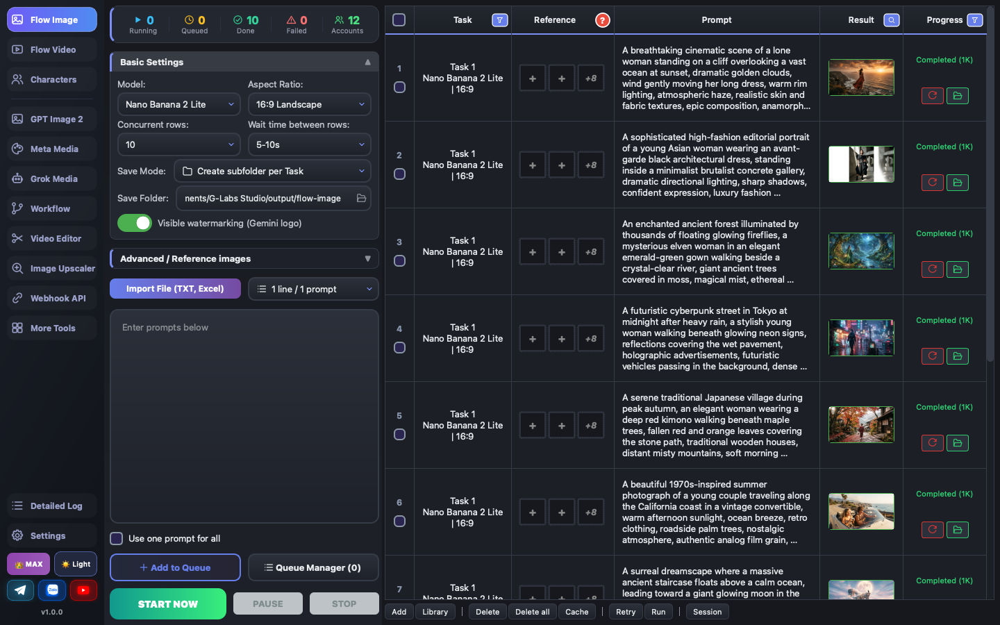
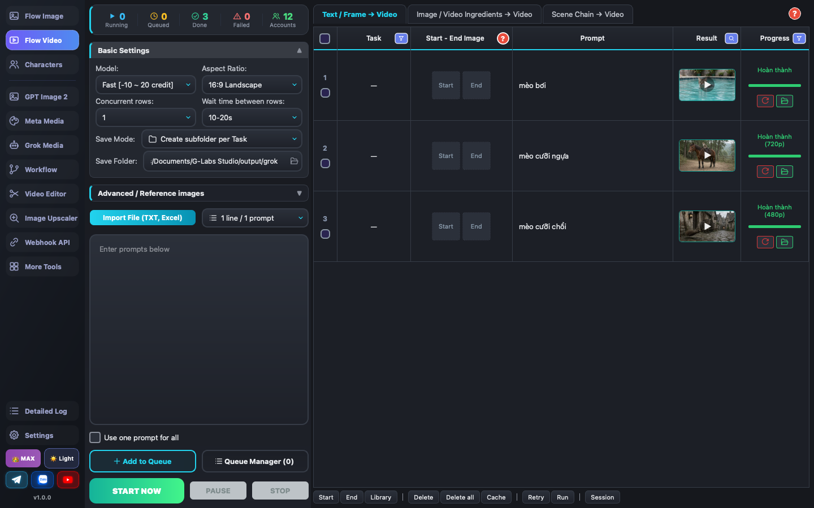
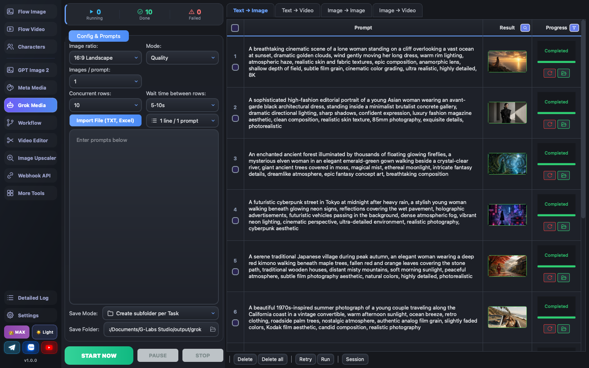
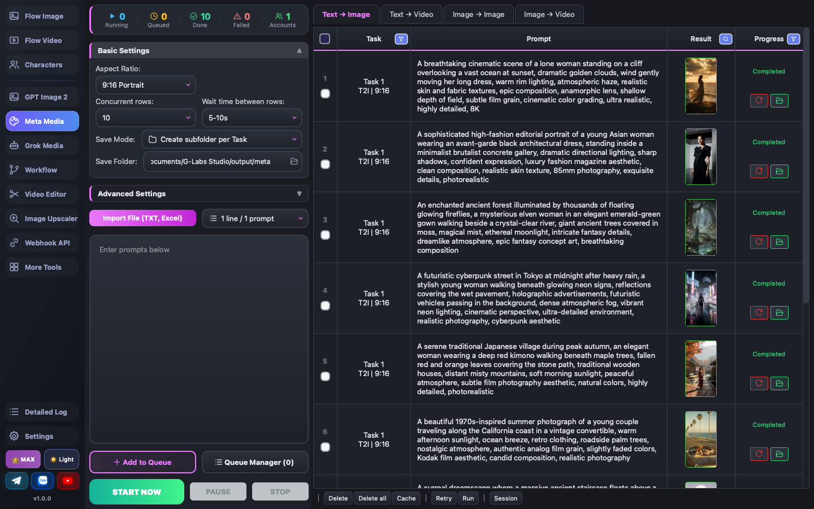
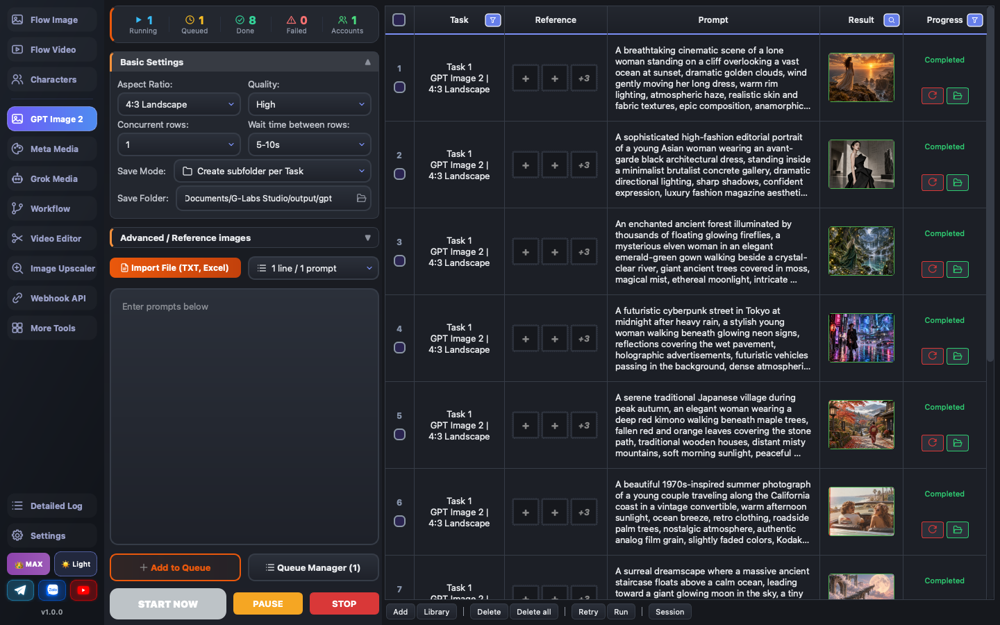
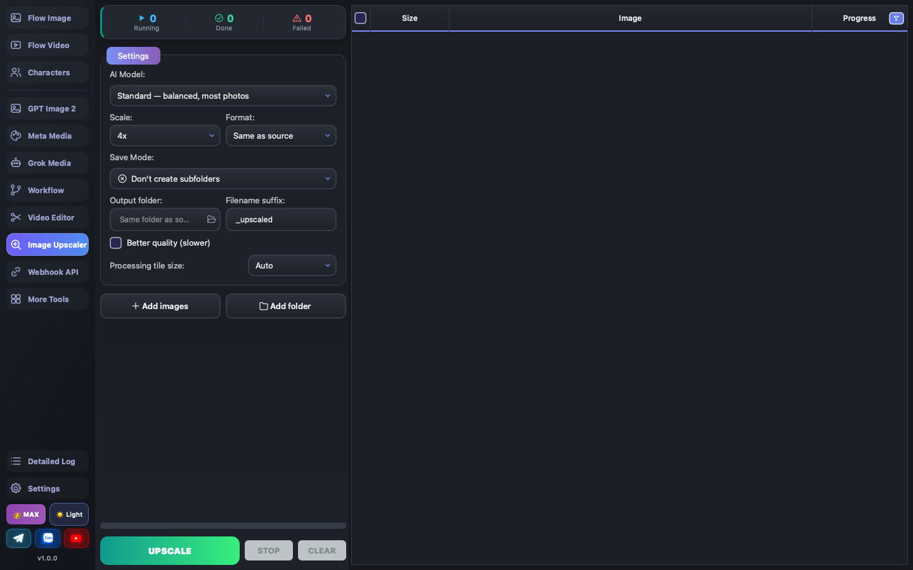
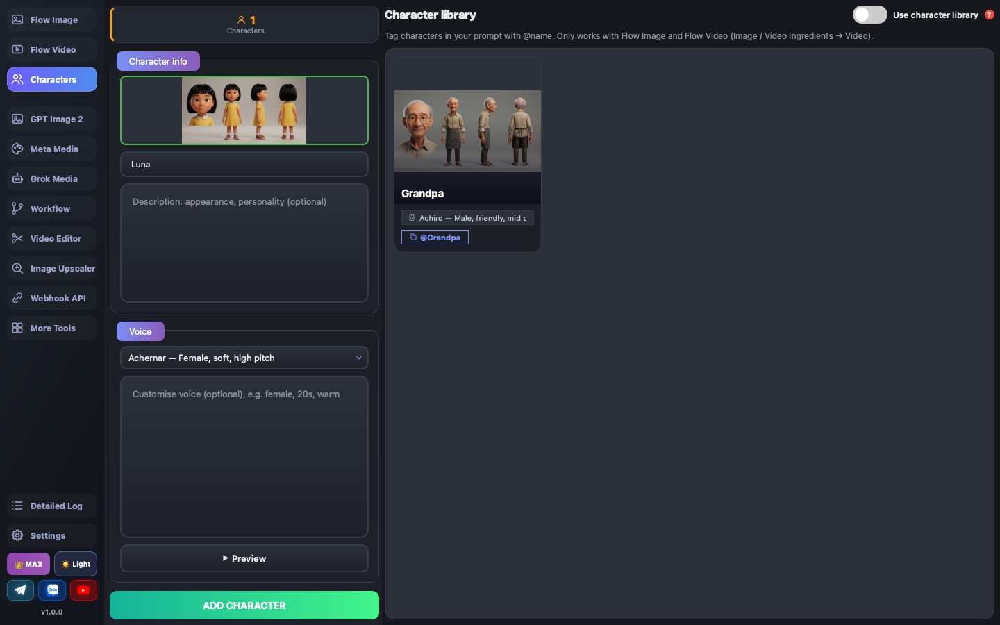
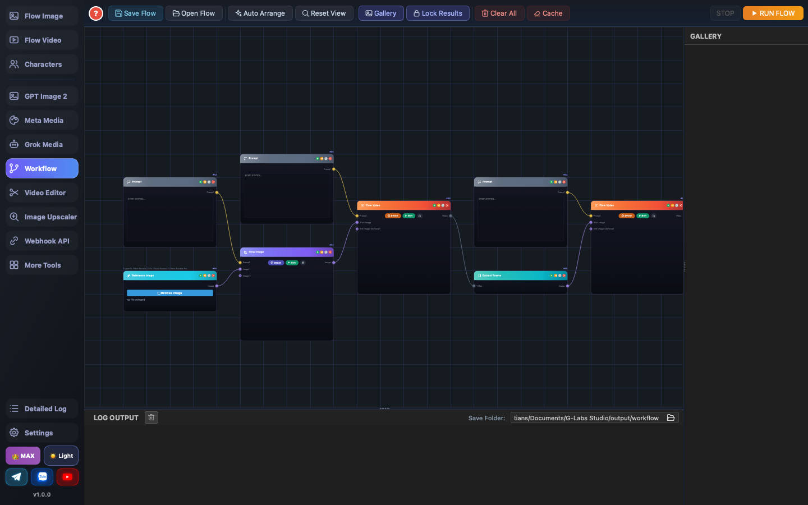
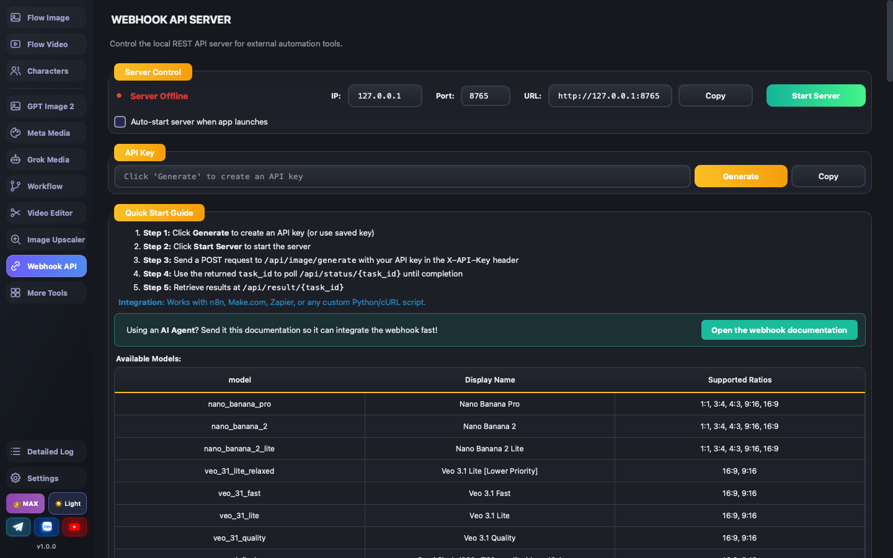

<h1 align="center">G-Labs Studio</h1>

<p align="center"><b>हर प्रमुख AI में छवियाँ और वीडियो बैच-जनरेट करने के लिए एक ही डेस्कटॉप ऐप — Google Flow (Veo 3.1, Omni Flash, Nano Banana), Grok Imagine, Meta AI और ChatGPT GPT Image 2।</b></p>

<p align="center">
  <a href="../../README.md">English</a> ·
  <a href="README.vi.md">Tiếng Việt</a> ·
  <a href="README.zh.md">简体中文</a> ·
  <a href="README.es.md">Español</a> ·
  <a href="README.pt.md">Português</a> ·
  <a href="README.ru.md">Русский</a> ·
  <b>हिन्दी</b> ·
  <a href="README.bn.md">বাংলা</a> ·
  <a href="README.th.md">ไทย</a> ·
  <a href="README.tr.md">Türkçe</a> ·
  <a href="README.ur.md">اردو</a> ·
  <a href="README.ar.md">العربية</a> ·
  <a href="README.de.md">Deutsch</a> ·
  <a href="README.id.md">Bahasa Indonesia</a> ·
  <a href="README.ko.md">한국어</a>
</p>

<p align="center">
  <a href="https://github.com/duckmartians/G-Labs-Studio/releases/latest/download/G-Labs-Studio-win.exe"></a>&nbsp;
  <a href="https://github.com/duckmartians/G-Labs-Studio/releases/latest/download/G-Labs-Studio-mac-arm64.dmg"></a>&nbsp;
  <a href="https://github.com/duckmartians/G-Labs-Studio/releases/latest/download/G-Labs-Studio-mac-intel.dmg"></a>
</p>



---

## इंस्टॉल

नवीनतम बिल्ड **[Releases](https://github.com/duckmartians/G-Labs-Studio/releases/latest)** से डाउनलोड करें:

| प्लेटफ़ॉर्म | फ़ाइल |
|---|---|
| 🪟 **Windows** | `G-Labs-Studio-win.exe` — इंस्टॉलर चलाएँ (admin/UAC) |
| 🍎 **macOS (Apple Silicon)** | `G-Labs-Studio-mac-arm64.dmg` |
| 🍎 **macOS (Intel)** | `G-Labs-Studio-mac-intel.dmg` |

**macOS पर पहली बार खोलना** — ऐप Apple द्वारा साइन नहीं है, इसलिए macOS इसे क्वारंटीन कर देता है। पहली बार इसे **राइट-क्लिक → Open** से खोलें, या Terminal से फ़्लैग हटाएँ:

```bash
xattr -dr com.apple.quarantine "/Applications/G-Labs Studio.app"
```

**आपको एक G-Labs अकाउंट चाहिए।** ऐप खोलें, Google से साइन इन करें और एक प्लान चुनें। प्लान (**FREE / PLUS / MAX**) अलग-अलग टूल और मॉडल अनलॉक करते हैं; आप इसे ऐप के भीतर से खरीद सकते हैं (बैंक QR, PayPal, या USDT)। एक अकाउंट **एक समय में एक ही मशीन** पर चलता है — कहीं और साइन इन करने से पिछली मशीन साइन आउट हो जाती है। साइडबार के नीचे-बाएँ का बैज आपका मौजूदा टियर दिखाता है।

ऐप **खुद को अपडेट करता है**: यह लॉन्च पर GitHub Releases जाँचता है और नए वर्ज़न को ऐप के भीतर से ही डाउनलोड और इंस्टॉल कर सकता है।

---

## पहली बार चलाना

1. **ऐप खोलें और Google से साइन इन करें।** टियर बैज (नीचे-बाएँ) आपके प्लान की पुष्टि करता है।
2. **जिन टूल का उपयोग करेंगे उनके अकाउंट कनेक्ट करें** (Settings → संबंधित अकाउंट टैब):
   - **Google** अकाउंट → Flow Image / Flow Video
   - **ChatGPT** अकाउंट → GPT Image 2
   - **Meta** अकाउंट → Meta Media
   - **Grok** → companion ब्राउज़र एक्सटेंशन (Auth Helper) के ज़रिए आपके लॉग-इन किए हुए `grok.com` टैब से चलता है — कोई अकाउंट पूल नहीं
   हर अकाउंट टैब अपनी टाइटल बार पर **"Active: N accounts"** दिखाता है ताकि आपको पता रहे कि कितने उपयोग योग्य हैं।
3. **बाईं साइडबार से एक पेज चुनें** और जनरेट करना शुरू करें। हर जनरेशन पेज का एक ही ढर्रा है: बाईं ओर प्रॉम्प्ट टाइप करें या इंपोर्ट करें, वे दाईं ओर एक **टेबल** में आ जाते हैं, फिर **Run** दबाएँ।

हर पेज के हेडर में एक लाइव **status bar** है — *Running · Queued · Done · Failed · Accounts* — ताकि आप बैच को एक नज़र में देख सकें। कतार प्रबंधक खोलने के लिए **Queued** पर क्लिक करें, अकाउंट सेटिंग्स पर जाने के लिए **Accounts** पर।

---

## विशेषताएँ

- **हर प्रमुख जनरेटर, एक ऐप** — Google Flow (छवि + वीडियो), Grok Imagine, Meta AI (vibes.ai) और OpenAI GPT Image 2, हर एक अपने पेज पर उन मॉडलों और अनुपातों के साथ जो वह प्रोवाइडर समर्थन करता है।
- **डिज़ाइन से ही बैच** — प्रॉम्प्ट की सूची पेस्ट करें (प्रति पंक्ति एक) या कोई `.txt`/Excel फ़ाइल इंपोर्ट करें; हर एक एक पंक्ति बन जाता है। रेफ़रेंस छवियाँ फ़ाइलनाम से अपने आप मिलान हो जाती हैं। पूरी सूची को अपनी चुनी हुई समवर्ती (concurrency) के साथ चलाएँ।
- **पहले जोड़ें, तैयार होने पर चलाएँ** — पंक्तियाँ कतार में जाती हैं; **Run / Pause / Stop** अलग-अलग हैं। जब तक आप न कहें कुछ शुरू नहीं होता, और एक कतार प्रबंधक आपको पुनर्व्यवस्थित और निरीक्षण करने देता है।
- **कैरेक्टर लाइब्रेरी** — एक कैरेक्टर को एक बार सहेजें (रेफ़रेंस छवि + उसका अपना वॉइस + नोट्स) और उसे `@name` से किसी भी प्रॉम्प्ट में डालें; वीडियो उस कैरेक्टर का रूप और आवाज़ बनाए रखता है।
- **Workflow (नोड ग्राफ़)** — नोड्स को एक पाइपलाइन में जोड़ें: प्रॉम्प्ट → छवि → वीडियो → अंतिम फ़्रेम निकालें → अगला वीडियो, साथ ही एक **Merge Video** नोड जो दो क्लिप को ट्रिम और ट्रांज़िशन (crossfade, wipe, slide, dissolve…) के साथ जोड़ता है। बैच नोड्स प्रति प्रॉम्प्ट या प्रति छवि पूरी शृंखला को लूप करते हैं।
- **Webhook API** — एक लोकल REST सर्वर ताकि स्क्रिप्ट और AI एजेंट image/video/Grok/Meta/OpenAI जॉब सबमिट कर सकें और परिणामों के लिए पोल कर सकें।
- फ़िनिशिंग के लिए **Image Upscaler** और एक **Video Editor** (कट, स्टिच, स्लाइडशो)।
- **लचीला** — परिणाम सत्यापित और स्वतः-सहेजे जाते हैं; सत्र बहाल होते हैं; असफल पंक्तियाँ पुनः प्रयास करती हैं।
- **डार्क / लाइट थीम**, टियर-सजग UI, और **15 भाषाएँ**।

---

## पेज

### 🖼 Flow Image — Google Flow छवि जनरेशन


**Nano Banana Pro / 2 / Lite** के साथ छवियाँ बैच-जनरेट करें। मॉडल, आस्पेक्ट रेशियो और रिज़ॉल्यूशन चुनें (**1K / 2K / 4K** — 2K/4K मॉडल के अपस्केलर का उपयोग करते हैं), तय करें कि एक साथ कितनी पंक्तियाँ चलें और उनके बीच का विलंब। प्रॉम्प्ट पेस्ट करें (या फ़ाइल इंपोर्ट करें), प्रति पंक्ति रेफ़रेंस छवियाँ जोड़ें (एक फ़ोल्डर खींचें और वे फ़ाइलनाम से अपने आप मिलान हो जाती हैं), और कैरेक्टर लाने के लिए `@name` का उपयोग करें। **Run** पूरी सूची को कतार में भेजता है।

### 🎬 Flow Video — Veo और Omni Flash



तीन टैब: **Text / Frames → Video** (एक टेक्स्ट प्रॉम्प्ट, या एक स्टार्ट/एंड फ़्रेम), **Image / Video ingredients → Video** (रेफ़रेंस छवियाँ या एक रेफ़रेंस वीडियो), और **Scene stitch → Video**। मॉडल: **Veo 3.1 Fast / Lite / Quality** और **Omni Flash**। आस्पेक्ट रेशियो, अपस्केल (720p / 1080p / 4K) और seed चुनें। frames बनाम ingredients के सरल-भाषा स्पष्टीकरण के लिए टैब बार पर **?** पर होवर करें।

### 🤖 Grok Media — Grok Imagine



Grok Imagine के ज़रिए टेक्स्ट-टू-इमेज, इमेज-टू-इमेज, टेक्स्ट-टू-वीडियो और इमेज-टू-वीडियो (Auth Helper एक्सटेंशन के ज़रिए आपका लॉग-इन किया हुआ `grok.com` टैब)। छवियाँ **8 आस्पेक्ट रेशियो** देती हैं (4:3, 21:9, 5:2 सहित); वीडियो **480p / 720p / 1080p** पर जनरेट होता है। इमेज-टू-वीडियो के दो मोड हैं: **First frame** (छवि क्लिप शुरू करती है) और **Reference** (अधिकतम 14 मार्गदर्शक छवियाँ)।

### 🎨 Meta Media — Meta AI (vibes.ai)



Meta AI के ज़रिए छवि और वीडियो जनरेशन। मोड: टेक्स्ट-टू-इमेज, इमेज-टू-इमेज (Character / Scene / Style घटक), टेक्स्ट-टू-वीडियो और इमेज-टू-वीडियो (स्टार्ट / एंड फ़्रेम)।

### ✨ GPT Image 2 — OpenAI



अपने ChatGPT अकाउंट का उपयोग करके OpenAI **GPT Image 2** के साथ जनरेट करें, अधिकतम 5 रेफ़रेंस छवियों के साथ। रेशियो (10 विकल्प, जिनमें 21:9, 4:5 और **custom** शामिल हैं — जहाँ आप रेशियो प्रॉम्प्ट में लिखते हैं), गुणवत्ता, प्रॉम्प्ट मोड, reasoning effort और वेब सर्च चुनें।

### 🔍 Image Upscaler



छवियों के एक फ़ोल्डर को लोकल तौर पर अपस्केल करें — लक्ष्य चुनें और कतार को प्रोसेस होने दें, प्रति-पंक्ति प्रगति और स्थिति (processing / done / error) के साथ।

### 👤 Characters



पुन: उपयोग योग्य कैरेक्टरों की एक लाइब्रेरी बनाएँ: एक रेफ़रेंस छवि, एक वैकल्पिक कस्टम वॉइस, और रूप/व्यक्तित्व नोट्स। किसी भी Flow प्रॉम्प्ट में उन्हें `@name` से टैग करें और जनरेशन उस पहचान को बनाए रखेगा।

### 🔗 Workflow



एक विज़ुअल नोड कैनवास। किसी नोड के सॉकेट पर राइट-क्लिक करें और मेनू केवल वही नोड देता है जो फ़िट होते हैं — एक चुनें और वह अपने आप जुड़ जाता है। प्रॉम्प्ट → generate → वीडियो → **Extract Frame** → अगला वीडियो शृंखलाबद्ध करें, और दो क्लिप जोड़ने के लिए **Merge Video** का उपयोग करें (हर सिरे को ट्रिम करें, एक ट्रांज़िशन चुनें)। पूरे ग्राफ़ को एक `.json` फ़ाइल के रूप में सहेजें/लोड करें; **Run Flow** इसे शुरू से अंत तक चलाता है।

### 🌐 Webhook API



ऐप को एक लोकल ऑटोमेशन सर्वर में बदलें। इसे स्टार्ट करें, अपनी API key कॉपी करें, और `/api/image/generate`, `/api/video/generate`, `/api/grok/generate`, `/api/meta/generate` या `/api/openai/generate` पर जॉब POST करें, फिर `/api/status/<id>` को पोल करें। पेज हर मॉडल और उसके समर्थित आस्पेक्ट रेशियो की सूची देता है। पूरा स्कीमा: [`docs/WEBHOOK_INTEGRATION.en.md`](../WEBHOOK_INTEGRATION.en.md)।

---

## चीज़ें कहाँ रहती हैं

| क्या | macOS | Windows |
|---|---|---|
| आउटपुट (छवियाँ / वीडियो) | `~/Documents/G-Labs Studio` | `%USERPROFILE%\Documents\G-Labs Studio` |
| सेटिंग्स, सत्र, अकाउंट | `~/Library/Application Support/G-Labs Studio` | `%APPDATA%\G-Labs Studio` |

आपकी सेटिंग्स, प्रॉम्प्ट सूचियाँ, सत्र, कैरेक्टर लाइब्रेरी और अकाउंट सूची सहेजी जाती हैं और अगली बार ऐप खोलने पर बहाल हो जाती हैं।

---

## समस्या निवारण

**सब कुछ लॉक है / खरीदने वाली स्क्रीन बार-बार खुलती है** — आपका प्लान समाप्त हो गया, या अकाउंट किसी दूसरी मशीन पर साइन इन हो गया। टियर बैज (नीचे-बाएँ) जाँचें और नवीनीकृत करें।

**Grok जनरेशन कुछ नहीं करता** — Grok आपके `grok.com` टैब से चलता है। **Auth Helper** ब्राउज़र एक्सटेंशन इंस्टॉल/इनेबल करें (Settings → Grok) और सुनिश्चित करें कि आप grok.com पर लॉग-इन हैं।

**किसी पेज पर "Active: 0 accounts"** — उस पेज के अकाउंट टैब (Settings) में कोई अकाउंट जोड़ें या फिर से इनेबल करें, या उसका टोकन समाप्त हो गया — **Refresh all** दबाएँ।

**macOS कहता है ऐप damaged है / खोला नहीं जा सकता** — यह Apple द्वारा साइन नहीं है। पहली बार राइट-क्लिक → **Open** करें, या `xattr -dr com.apple.quarantine "/Applications/G-Labs Studio.app"` चलाएँ।

**अपडेट इंस्टॉल नहीं होता** — नवीनतम बिल्ड को [Releases](https://github.com/duckmartians/G-Labs-Studio/releases/latest) से मैन्युअल रूप से डाउनलोड करें।
