<h1 align="center">G-Labs Studio</h1>

<p align="center"><b>Um único app de desktop para gerar imagens &amp; vídeos em lote em todas as grandes IAs — Google Flow (Veo 3.1, Omni Flash, Nano Banana), Google Vids, Google Pics, ChatGPT GPT Image 2, Meta Vibes e Grok — além de ferramentas de vídeo, um workflow de nós e uma Webhook API.</b></p>

<p align="center">
  <a href="README.en.md">English</a> ·
  <a href="../../README.md">Tiếng Việt</a> ·
  <a href="README.zh.md">简体中文</a> ·
  <a href="README.es.md">Español</a> ·
  <b>Português</b> ·
  <a href="README.ru.md">Русский</a> ·
  <a href="README.hi.md">हिन्दी</a> ·
  <a href="README.bn.md">বাংলা</a> ·
  <a href="README.th.md">ไทย</a> ·
  <a href="README.tr.md">Türkçe</a> ·
  <a href="README.ur.md">اردو</a> ·
  <a href="README.ar.md">العربية</a> ·
  <a href="README.de.md">Deutsch</a> ·
  <a href="README.id.md">Bahasa Indonesia</a> ·
  <a href="README.ko.md">한국어</a>
</p>

<p align="center">
  <a href="https://github.com/duckmartians/G-Labs-Studio/releases/latest/download/G-Labs-Studio-win.exe"></a>&nbsp;
  <a href="https://github.com/duckmartians/G-Labs-Studio/releases/latest/download/G-Labs-Studio-mac-arm64.dmg"></a>&nbsp;
  <a href="https://github.com/duckmartians/G-Labs-Studio/releases/latest/download/G-Labs-Studio-mac-intel.dmg"></a>
</p>

---

## Instalação

### Passo 1 — Escolha a versão certa para a sua máquina

Baixe a versão mais recente em **[Releases](https://github.com/duckmartians/G-Labs-Studio/releases/latest)** e escolha o arquivo que corresponde à sua máquina:

| Sua máquina | Baixar | Google Drive | Observações |
|---|---|---|---|
| 🪟 **Windows 10/11 (64 bits)** | [Windows](https://github.com/duckmartians/G-Labs-Studio/releases/latest/download/G-Labs-Studio-win.exe) | [Windows](https://drive.google.com/drive/u/0/folders/1ovx97E2UJ4qeIoiHg-_0dinDQC1rjR46) | Para qualquer PC com Windows |
| 🍎 **Mac com chip Apple (M1/M2/M3/M4)** | [macOS ARM](https://github.com/duckmartians/G-Labs-Studio/releases/latest/download/G-Labs-Studio-mac-arm64.dmg) | [macOS ARM](https://drive.google.com/drive/u/0/folders/1kfENU5CPWq_Djo641XvWiZERdKNun26Q) | Macs a partir do fim de 2020 |
| 🍎 **Mac com chip Intel** | [macOS Intel](https://github.com/duckmartians/G-Labs-Studio/releases/latest/download/G-Labs-Studio-mac-intel.dmg) | [macOS Intel](https://drive.google.com/drive/u/0/folders/1qvFV8P5k6FpHfGfnwbL8CccrwXgGoYg0) | Macs mais antigos (antes de 2020) |

**Não sabe qual chip o seu Mac tem?** Clique no menu  (canto superior esquerdo) → **About This Mac**:
- Uma linha **Chip** com “Apple M1 / M2 / M3…” → baixe a versão **arm64**.
- Uma linha **Processor** com “Intel…” → baixe a versão **intel**.

> A versão **Intel** ainda roda num Mac com chip Apple (só que mais devagar), mas a versão **arm64** **não abre** num Mac Intel — então escolha a certa.

### Passo 2 — Instalar

<details open>
<summary><b>🪟 No Windows</b></summary>

1. Abra o **`G-Labs-Studio-win.exe`** baixado.
2. Se aparecer **“Windows protected your PC”** (SmartScreen): clique em **More info** → **Run anyway**. *(O app ainda não é assinado com um certificado da Microsoft, por isso é sinalizado — não é vírus.)*
3. Clique em **Yes** no aviso de administrador (UAC) e siga o instalador até o fim.
4. Abra pelo **Start Menu** ou pelo atalho na **Desktop**.

</details>

<details open>
<summary><b>🍎 No macOS</b></summary>

1. Abra o **`.dmg`** baixado e **arraste o G-Labs Studio para a pasta Applications**.
2. Vá em **Applications**, **clique com o botão direito** (ou Control-clique) em **G-Labs Studio** → **Open** → clique em **Open** de novo na caixa de diálogo. *(O app não é assinado pela Apple, então você precisa abri-lo assim na **primeira vez**; depois abre normalmente.)*
3. Se o macOS disser que o app está **“danificado / não pode ser aberto”**, ou não houver botão Open, abra o **Terminal** e cole:
   ```bash
   xattr -dr com.apple.quarantine "/Applications/G-Labs Studio.app"
   ```
   Depois abra o app de novo.

</details>

### Passo 3 — Faça login e escolha um plano

**Você precisa de uma conta G-Labs.** Abra o app, faça login com o Google e escolha um plano. Os planos (**BASIC / PLUS / MAX**) desbloqueiam ferramentas e modelos diferentes; você pode comprar um dentro do app (QR bancário, PayPal ou USDT). Uma conta funciona em **uma máquina por vez** — fazer login em outro lugar desconecta a máquina anterior. O selo no canto inferior esquerdo da barra lateral mostra o seu nível atual. Precisa de vários dispositivos ao mesmo tempo? Você pode comprar um plano **Team** (o preço aumenta conforme o número de dispositivos extras que você escolher).

> **Acabou de migrar da versão antiga (G-Labs Automation)?** A nova versão **não** leva as suas contas. Você vai precisar **fazer login em todas as contas de novo** (Google/Flow, ChatGPT, Meta…) na nova G-Labs Studio.

O app **se atualiza sozinho**: ele verifica o GitHub Releases ao iniciar e pode baixar e instalar a nova versão de dentro do app.

---

## Primeira execução

1. **Abra o app e entre com o Google.** O selo de nível (canto inferior esquerdo: **BASIC / PLUS / MAX**) confirma seu plano.
2. **Conecte as contas das ferramentas que você vai usar** (**Configurações** → a aba de contas correspondente):
   - **Contas Flow** → Flow Imagem / Flow Vídeo
   - **Contas Google** → **Google Vids** e **Google Pics** (as duas páginas compartilham essas contas Google; cada conta é ativada separadamente para os vídeos do Vids e para as imagens do Pics)
   - **Conta ChatGPT** → GPT Image 2
   - **Conta Vibes** → Meta Vibes
   - **Conta Grok** → sem armazenamento de contas: esta aba orienta você a instalar a extensão de navegador **Auth Helper**, e então o Grok funciona pela sua aba `grok.com` com login feito no Chrome

   Cada aba de contas mostra **"Ativas: N contas"** na barra de título para você saber quantas estão utilizáveis.
3. **Escolha uma página na barra lateral esquerda** e comece a gerar. Toda página de geração segue o mesmo ritmo: digite ou importe prompts à esquerda, eles caem em uma **tabela** à direita, e então pressione **Run**.

Todo cabeçalho de página traz uma **barra de status** ao vivo — *Em execução · Na fila · Concluído · Falhou · Contas* — para você ver o lote inteiro de relance. Clique em **Na fila** para abrir o gerenciador de fila e em **Contas** para ir às configurações de conta.

---

## Recursos

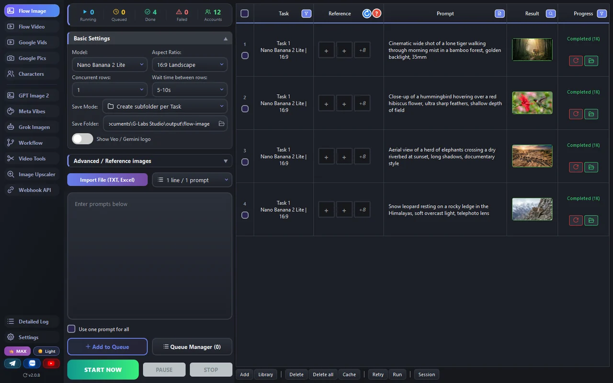

- **Todos os grandes geradores, um app** — Google Flow (imagem + vídeo), Google Vids, Google Pics, GPT Image 2, Meta Vibes e Grok, cada um em sua própria página com os modelos e proporções que aquele provedor suporta.
- **Feito para lotes** — cole uma lista de prompts (um por linha) ou importe `.txt`/Excel; cada prompt vira uma linha. Imagens de referência são combinadas automaticamente pelo nome do arquivo. Execute a lista inteira com o número de threads paralelas que você escolher.
- **Adicione primeiro, execute quando estiver pronto** — as linhas vão para uma fila; **Run / Pause / Stop** são separados. Nada começa até você mandar, e o gerenciador de fila permite reordenar e inspecionar.
- **Remoção automática do logo Gemini ✦** — imagens do Google Pics e vídeos do Google Vids são limpos logo após o download (ative **Mostrar logo Gemini** para mantê-lo). Arquivos sem o logo não são alterados.
- **Biblioteca de personagens** — salve um personagem uma vez (imagem de referência + voz + notas) e chame-o com `@name` nos prompts do Flow Imagem, Flow Vídeo e Google Vids para manter as cenas consistentes.
- **Workflow (grafo de nós)** — conecte nós em um pipeline: prompt → imagem → vídeo → extrair o último quadro → próximo vídeo, além de um nó **Juntar vídeo** que une dois clipes com uma transição.
- **Ferramentas de Vídeo** — edição de vídeo em linha do tempo, slideshows de imagens sincronizados com legendas, divisão de vídeo, extração de quadros e remoção de logo de vídeo, dentro do próprio app.
- **Ampliar Imagem** na sua própria máquina e uma **Webhook API** para automação.
- **Resiliente** — os resultados são verificados e salvos automaticamente; as sessões são restauradas; linhas que falham são repetidas.
- **Tema claro / escuro**, interface conforme o nível, e **15 idiomas**.

---

## Páginas

### 🖼 Flow Imagem — geração de imagens do Google Flow


Gere imagens em lote com **Nano Banana Pro / 2 / 2 Lite**. Escolha o modelo, a proporção e a resolução (**1K / 2K / 4K** — 2K/4K usam o upscaler do modelo), defina quantas linhas rodam de uma vez e o atraso entre elas. Cole prompts (ou importe um arquivo), anexe imagens de referência por linha (solte uma pasta e elas se combinam automaticamente pelo nome do arquivo), e use `@name` para trazer um personagem. O botão **Mostrar logo Veo / Gemini** (desligado por padrão) é compartilhado com a página Flow Vídeo. **Run** envia a lista inteira para a fila.

### 🎬 Flow Vídeo — Veo &amp; Omni Flash

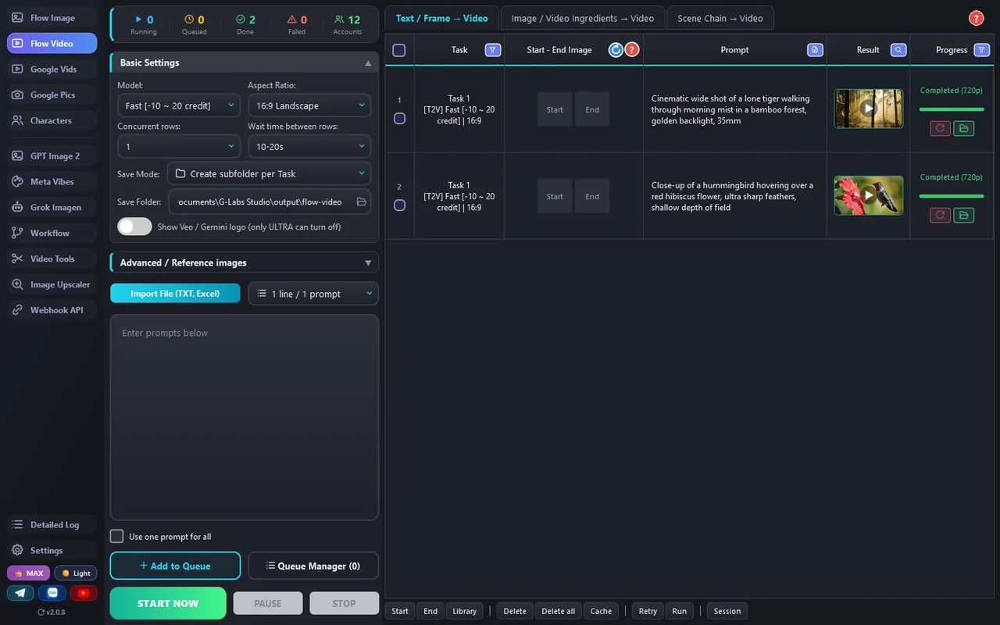

Três abas: **Texto / Quadro → Vídeo** (um prompt de texto, ou quadros inicial/final), **Componentes de Imagem / Vídeo → Vídeo** (imagens de referência ou um vídeo de referência) e **Cenas Encadeadas → Vídeo**. Modelos: **Veo 3.1 Fast / Lite / Quality** e **Omni Flash**. Escolha a proporção, o upscale (720p / 1080p / 4K) e a seed. Passe o cursor sobre o **?** na barra de abas para uma explicação simples sobre quadros versus componentes.

### 📽 Google Vids

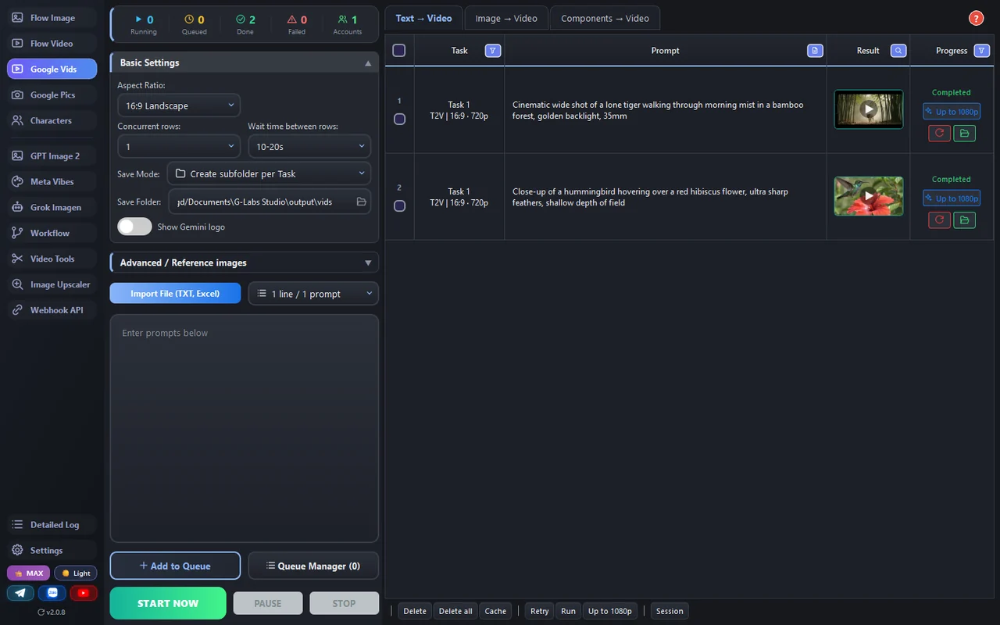

Crie vídeos com sua conta Google em três abas: **Texto → Vídeo**, **Imagem → Vídeo** (uma imagem de abertura) e **Componentes → Vídeo** (até 3 imagens de componentes). Escolha paisagem/retrato, 720p / 1080p e uma duração de 3–10 segundos — ou coloque uma tag como `[4s]` no prompt para dar a cada linha sua própria duração. Vídeos prontos podem ser ampliados para 1080p direto da tabela. Cada conta tem uma cota medida em segundos de vídeo; adicione mais contas para rodar mais rápido. O logo Gemini ✦ dos vídeos baixados (720p / 1080p) é removido automaticamente, a menos que você ative **Mostrar logo Gemini**.

### 🖼 Google Pics

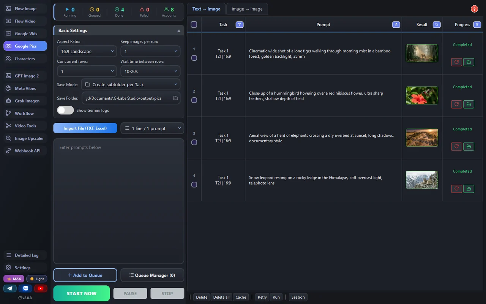

Duas abas: **Texto → Imagem** e **Imagem → Imagem** com **até 14 imagens de referência** (personagens, objetos, cenas, estilo). A cada execução o Google retorna 3–9 imagens; **Imagens mantidas por execução** decide quantas manter (1–4 ou todas). 10 proporções, incluindo 21:9, 3:2 e 5:4. Cada execução custa 1 execução do Google Pics, seja qual for o número de imagens; um prompt recusado pela política de conteúdo não custa nada. O Pics compartilha as **Contas Google** com o Google Vids.

**Remoção automática do logo Gemini ✦:** as imagens do Pics baixadas têm a marca ✦ do canto inferior direito removida logo após o download, usando um mapa do logo medido especificamente para o Google Pics — a mistura do logo é revertida, então a textura original por baixo dele é restaurada em vez de borrada. Imagens em que nenhum logo é detectado ficam como estão. Para manter o logo, ative **Mostrar logo Gemini**.

### ✨ GPT Image 2 — OpenAI

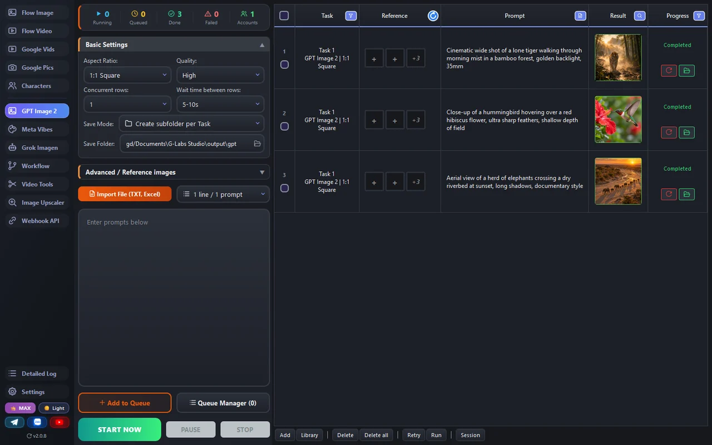

Gere com o OpenAI **GPT Image 2** usando sua conta ChatGPT, com até 5 imagens de referência. Escolha a proporção (10 opções, incluindo 21:9, 4:5 e **custom** — onde você escreve a proporção no prompt), a qualidade, o modo de prompt, o nível de raciocínio e a busca na web.

### 🎨 Meta Vibes

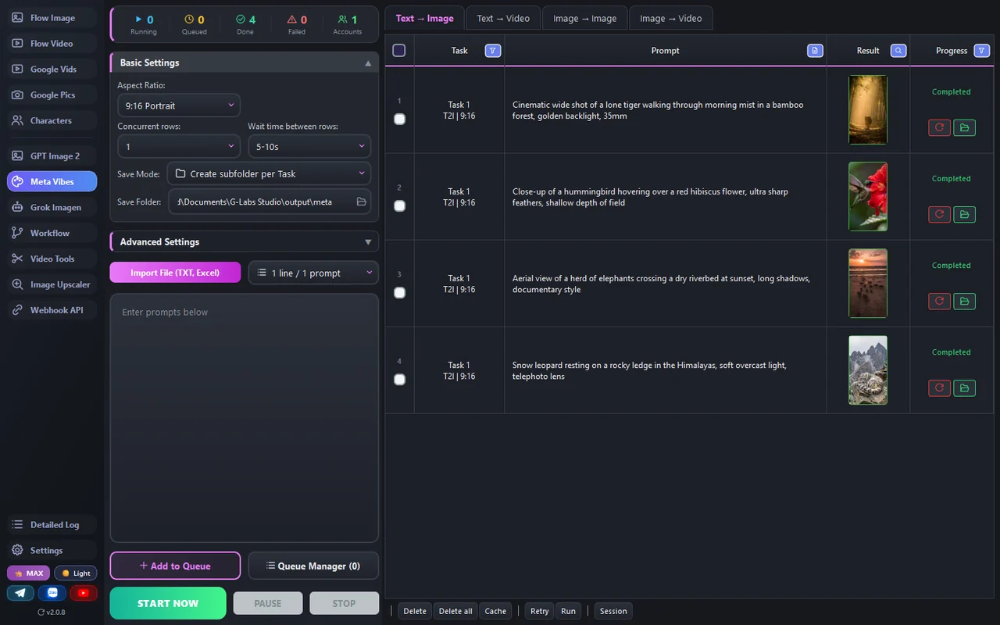

Crie imagens e vídeos no Meta Vibes em quatro abas: **Texto → Imagem**, **Texto → Vídeo**, **Imagem → Imagem** (imagens de personagem / cena / estilo) e **Imagem → Vídeo** (quadro inicial / final). Enfileirados e baixados automaticamente.

### 🤖 Grok Imagen

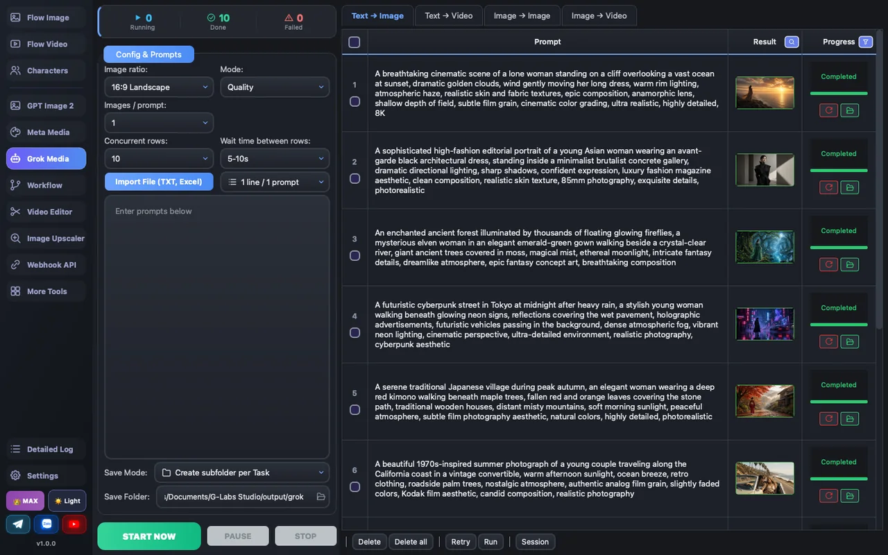

Texto → Imagem, Imagem → Imagem, Texto → Vídeo e Imagem → Vídeo pelo Grok Imagine (sua aba `grok.com` com login feito, por meio da extensão Auth Helper). As imagens vêm em **8 proporções** (incl. 4:3, 21:9, 5:2); os vídeos são renderizados em **480p / 720p / 1080p**. Imagem → Vídeo tem dois modos: **Primeiro quadro** (a imagem abre o clipe) e **Imagens ref.** (até 14 imagens de orientação).

### 👤 Personagens

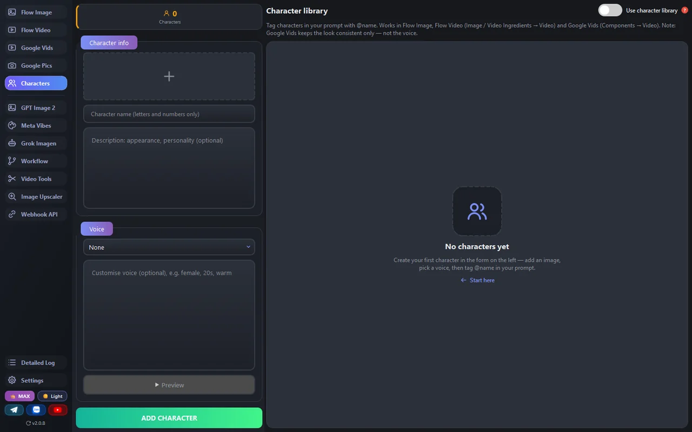

Monte um elenco reutilizável: uma imagem de referência, uma voz (uma das vozes predefinidas do Flow, com uma descrição opcional da forma de falar) e notas de aparência/personalidade. Marque-os com `@name` nos prompts do Flow Imagem, Flow Vídeo e Google Vids e a geração preserva essa identidade (a voz é usada apenas pelo Flow Vídeo; o Google Vids usa a imagem).

### 🔗 Workflow

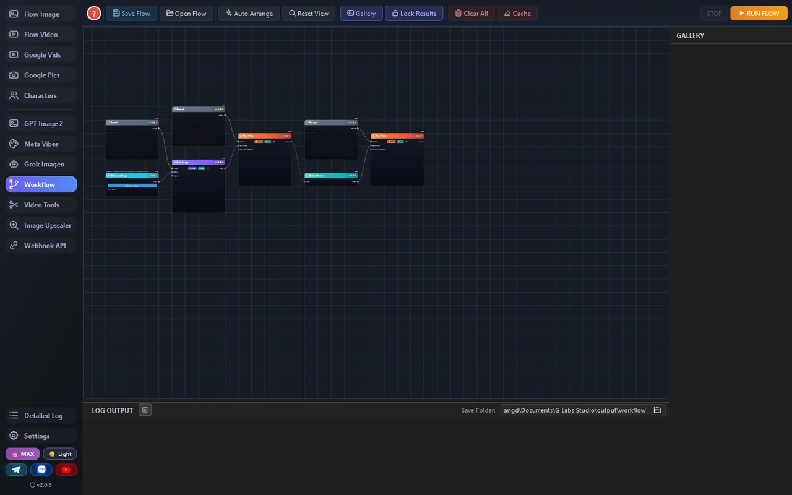

Um canvas visual de nós. Clique com o botão direito no soquete de um nó e o menu oferece apenas os nós que se encaixam — escolha um e ele se conecta sozinho. Há nós para Flow Imagem, Flow Vídeo, Grok, Meta e GPT Image 2. Encadeie prompt → imagem → vídeo → **Extrair Quadro** → próximo vídeo, e use **Juntar vídeo** para unir dois clipes (corte cada ponta, escolha uma transição). Salve/carregue o grafo inteiro como um arquivo `.json` (formato: [`WORKFLOW_JSON_SPEC.md`](../../WORKFLOW_JSON_SPEC.md)); **Run Flow** o executa de ponta a ponta.

### 🎞 Ferramentas de Vídeo

Cinco abas em uma página:

**Edição de Vídeo** — uma linha do tempo para vídeo, legendas SRT e áudio: corte, divida, reordene, ajuste automaticamente e então exporte um único vídeo finalizado.

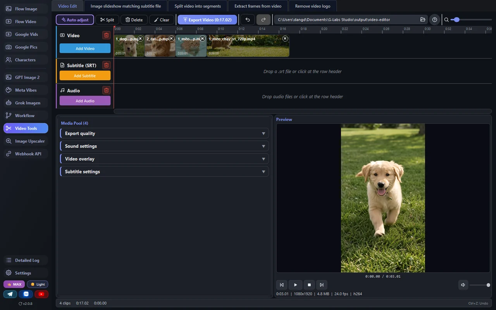

**Slideshow de imagens conforme legendas** — carregue imagens e um arquivo `.srt`; cada imagem é combinada automaticamente com uma linha de legenda, com efeitos de movimento, sobreposições e estilo de legenda.

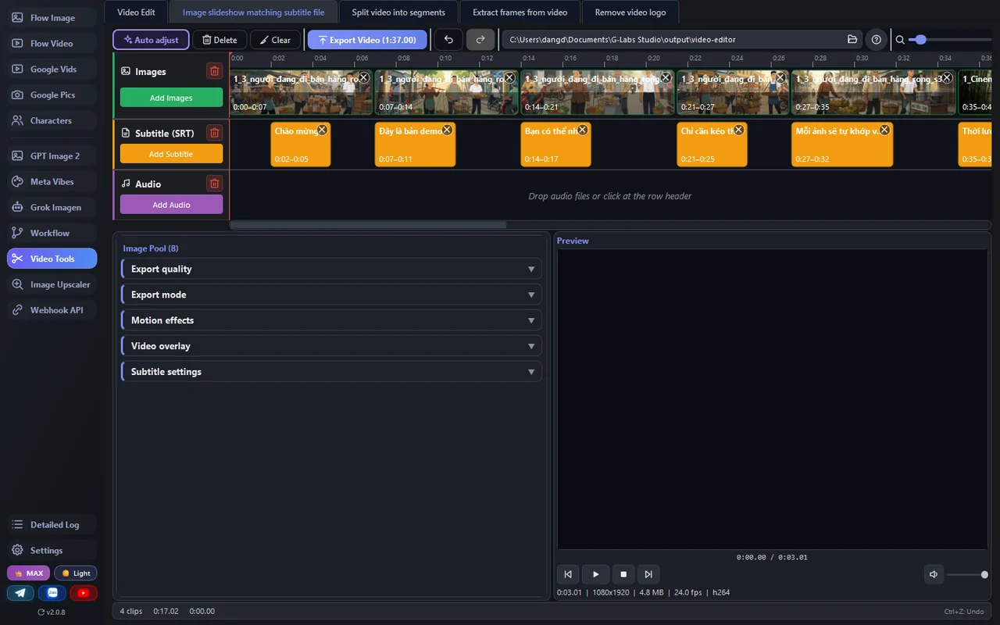

**Dividir vídeo em segmentos** — por número de partes, duração fixa ou aleatória, uma lista de marcações de tempo ou uma lista de intervalos A–B; um arquivo ou um lote inteiro, com aceleração por GPU quando disponível.

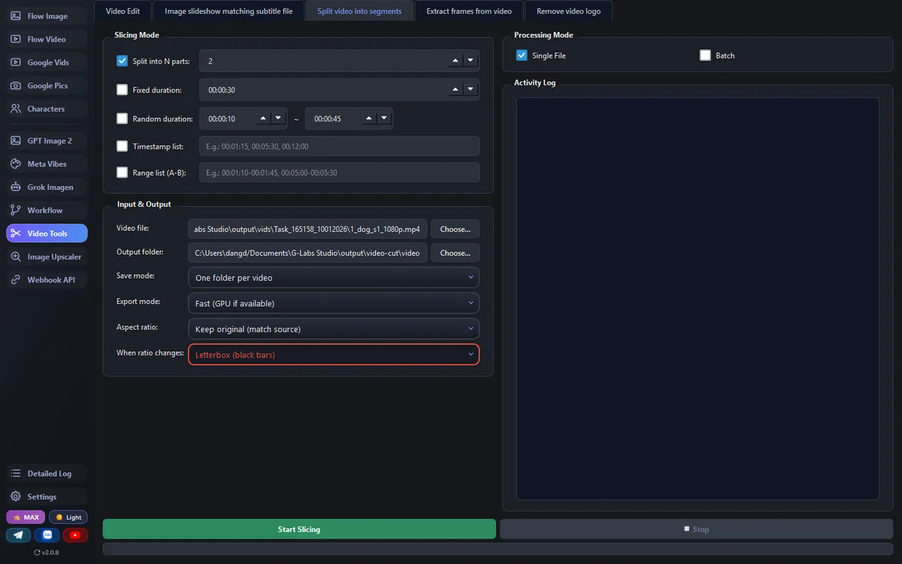

**Extrair quadros do vídeo** — por contagem total, intervalo de tempo, intervalo de quadros ou movimento; um arquivo ou uma pasta inteira.

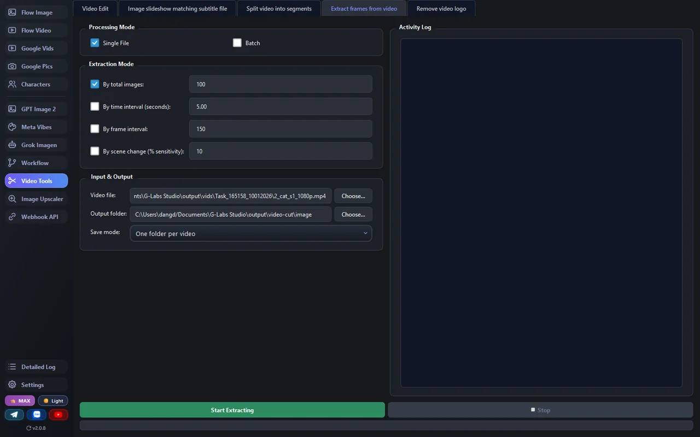

**Remover logo do vídeo** — remove o logo ✦ dos vídeos do Google Vids em 720p e 1080p (paisagem ou retrato), com uma prévia antes/depois no app. Vídeos sem o logo são ignorados; os originais são mantidos e os resultados são salvos como `<nome>_nologo.mp4`.

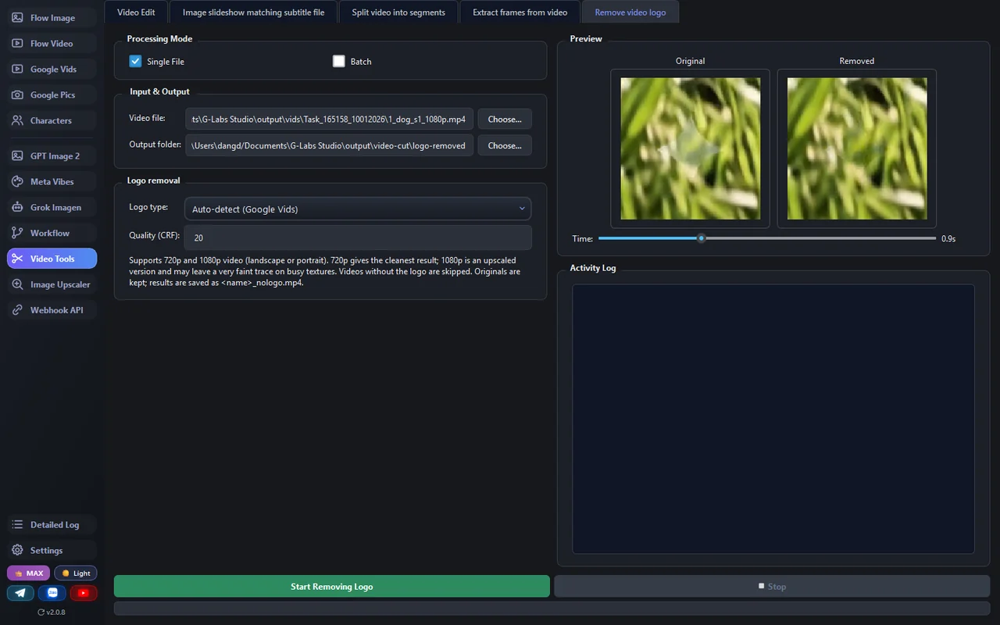

### 🔍 Ampliar Imagem

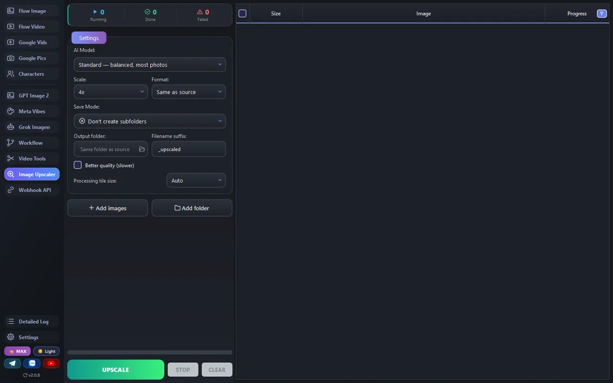

Amplie e dê nitidez a imagens direto no seu computador — adicione imagens avulsas ou uma pasta inteira, escolha um modelo de IA (Real-ESRGAN, UltraSharp, Remacri…) e uma escala de 2x–8x, acompanhe o progresso por linha e compare antes/depois.

### 🌐 Webhook API

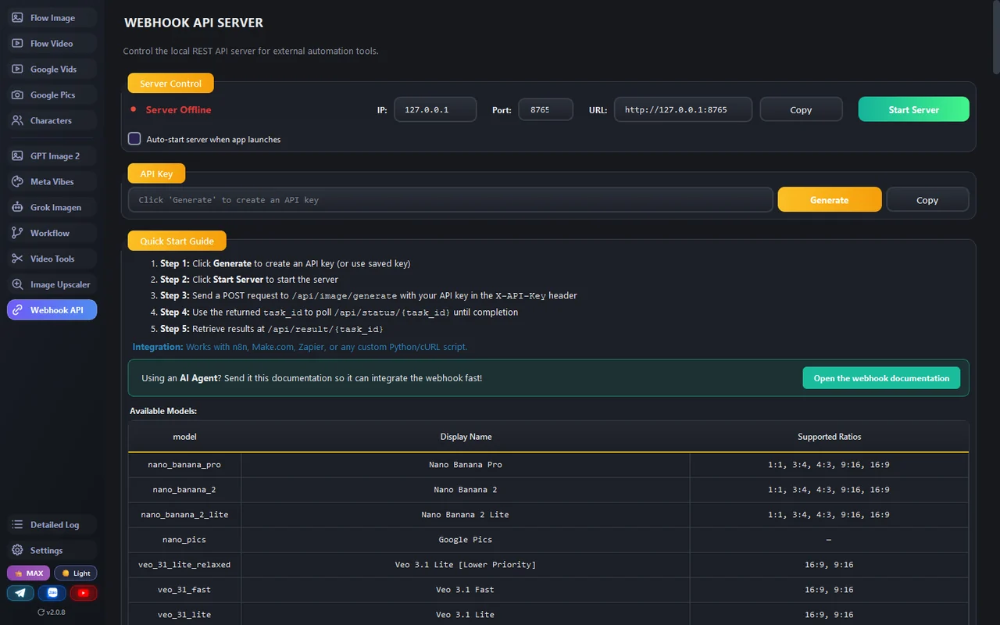

Transforme o app em um servidor de automação local (plano MAX) para que n8n, Make, Zapier, scripts ou agentes de IA possam enviar tarefas para a fila do app. Inicie-o, copie sua API key, e faça POST de tarefas para `/api/image/generate`, `/api/video/generate`, `/api/grok/generate`, `/api/meta/generate`, `/api/openai/generate` ou `/api/upscale/generate`, e então consulte `/api/status/<id>`. A página lista cada modelo e as proporções que ele suporta. Esquema completo: [`WEBHOOK_INTEGRATION.en.md`](../../WEBHOOK_INTEGRATION.en.md).

---

## Onde as coisas ficam

| O quê | macOS | Windows |
|---|---|---|
| Saídas (imagens / vídeos) | `~/Documents/G-Labs Studio/output` | `%USERPROFILE%\Documents\G-Labs Studio\output` |
| Configurações, sessões, contas, personagens | `~/Library/Application Support/G-Labs Studio` | `%APPDATA%\G-Labs Studio` |

Cada página tem sua própria subpasta dentro de `output` (uma pasta menor por execução); você pode alterar a pasta de salvamento em cada página. Suas configurações, listas de prompts, sessões, biblioteca de personagens e lista de contas são salvas e restauradas na próxima vez que você abrir o app.

---

## Solução de problemas

**Tudo está bloqueado / a tela de compra fica abrindo** — seu plano expirou, ou a conta entrou em outra máquina. Verifique o selo de nível (canto inferior esquerdo) e renove. Google Vids e Google Pics exigem um plano PLUS/MAX; a Webhook API exige MAX.

**Uma geração do Grok não faz nada** — o Grok funciona pela sua aba `grok.com`. Instale/ative a extensão de navegador **Auth Helper** (Configurações → Conta Grok) e certifique-se de estar logado no grok.com.

**O Google Pics diz que não há conta** — o Pics usa as contas do Google Vids. Adicione uma em Configurações → **Contas Google**.

**"Ativas: 0 contas" em uma página** — adicione ou reative uma conta na aba de contas daquela página (Configurações), ou o token dela expirou — pressione **Atualizar Tudo**.

**O Windows bloqueia com "Windows protected your PC"** — clique em **More info → Run anyway**. O app ainda não é assinado com um certificado da Microsoft, por isso é sinalizado — não é vírus.

**O macOS diz que o app está danificado / não pode ser aberto** — ele ainda não é assinado pela Apple. Clique com o botão direito → **Open** na primeira vez, ou execute `xattr -dr com.apple.quarantine "/Applications/G-Labs Studio.app"`.

**Uma atualização não instalou** — baixe a versão mais recente manualmente em [Releases](https://github.com/duckmartians/G-Labs-Studio/releases/latest).
