<h1 align="center">G-Labs Studio</h1>

<p align="center"><b>Một ứng dụng desktop để tạo hàng loạt ảnh &amp; video trên mọi nền tảng AI lớn - Google Flow (Veo 3.1, Omni Flash, Nano Banana), Google Vids, Google Pics, ChatGPT GPT Image 2, Meta Vibes và Grok - kèm công cụ video, workflow dạng node và Webhook API.</b></p>

<p align="center">
  <b>Tiếng Việt</b> ·
  <a href="README.en.md">English</a> ·
  <a href="README.zh.md">简体中文</a> ·
  <a href="README.es.md">Español</a> ·
  <a href="README.pt.md">Português</a> ·
  <a href="README.ru.md">Русский</a> ·
  <a href="README.hi.md">हिन्दी</a> ·
  <a href="README.bn.md">বাংলা</a> ·
  <a href="README.th.md">ไทย</a> ·
  <a href="README.tr.md">Türkçe</a> ·
  <a href="README.ur.md">اردو</a> ·
  <a href="README.ar.md">العربية</a> ·
  <a href="README.de.md">Deutsch</a> ·
  <a href="README.id.md">Bahasa Indonesia</a> ·
  <a href="README.ko.md">한국어</a>
</p>

<p align="center">
  <a href="https://github.com/duckmartians/G-Labs-Studio/releases/latest/download/G-Labs-Studio-win.exe"></a>&nbsp;
  <a href="https://github.com/duckmartians/G-Labs-Studio/releases/latest/download/G-Labs-Studio-mac-arm64.dmg"></a>&nbsp;
  <a href="https://github.com/duckmartians/G-Labs-Studio/releases/latest/download/G-Labs-Studio-mac-intel.dmg"></a>
</p>

---

## Cài đặt

### Bước 1 - Chọn đúng bản cho máy của bạn

Tải bản mới nhất từ **[Releases](https://github.com/duckmartians/G-Labs-Studio/releases/latest)**, rồi chọn tệp theo đúng máy:

| Máy của bạn | Tải tệp | Google Drive | Ghi chú |
|---|---|---|---|
| 🪟 **Windows 10/11 (64-bit)** | [Windows](https://github.com/duckmartians/G-Labs-Studio/releases/latest/download/G-Labs-Studio-win.exe) | [Windows](https://drive.google.com/drive/u/0/folders/1ovx97E2UJ4qeIoiHg-_0dinDQC1rjR46) | Dùng cho mọi PC Windows |
| 🍎 **Mac chip Apple (M1/M2/M3/M4)** | [macOS ARM](https://github.com/duckmartians/G-Labs-Studio/releases/latest/download/G-Labs-Studio-mac-arm64.dmg) | [macOS ARM](https://drive.google.com/drive/u/0/folders/1kfENU5CPWq_Djo641XvWiZERdKNun26Q) | Mac từ khoảng cuối 2020 về sau |
| 🍎 **Mac chip Intel** | [macOS Intel](https://github.com/duckmartians/G-Labs-Studio/releases/latest/download/G-Labs-Studio-mac-intel.dmg) | [macOS Intel](https://drive.google.com/drive/u/0/folders/1qvFV8P5k6FpHfGfnwbL8CccrwXgGoYg0) | Mac đời cũ (trước 2020) |

**Không chắc Mac của bạn chip gì?** Bấm biểu tượng  ở góc trên bên trái → **About This Mac**:
- Có dòng **Chip** ghi "Apple M1 / M2 / M3…" → tải bản **arm64**.
- Có dòng **Processor** ghi "Intel…" → tải bản **intel**.

> Tải nhầm bản **Intel** cho máy Apple thì vẫn chạy được nhưng chậm hơn; còn tải nhầm bản **arm64** cho máy Intel sẽ **không mở được**. Nên chọn đúng.

### Bước 2 - Cài đặt

<details open>
<summary><b>🪟 Trên Windows</b></summary>

1. Mở tệp **`G-Labs-Studio-win.exe`** vừa tải.
2. Nếu hiện bảng **"Windows protected your PC"** (SmartScreen): bấm **More info** → **Run anyway**. *(App chưa mua chứng chỉ ký của Microsoft nên bị cảnh báo - không phải virus.)*
3. Bấm **Yes** khi Windows hỏi quyền admin (UAC), rồi làm theo trình cài đặt tới khi xong.
4. Mở app từ **Start Menu** hoặc lối tắt trên **Desktop**.

</details>

<details open>
<summary><b>🍎 Trên macOS</b></summary>

1. Mở tệp **`.dmg`** vừa tải, rồi **kéo biểu tượng G-Labs Studio thả vào thư mục Applications**.
2. Vào **Applications**, **bấm chuột phải** (hoặc giữ Control rồi bấm) lên **G-Labs Studio** → chọn **Open** → bấm **Open** lần nữa ở hộp xác nhận. *(App chưa được Apple ký nên phải mở kiểu này ở **lần đầu**; những lần sau mở bình thường như mọi app.)*
3. Nếu macOS báo **"bị hỏng / không thể mở"** hoặc không thấy nút Open, mở **Terminal** và dán lệnh sau rồi Enter:
   ```bash
   xattr -dr com.apple.quarantine "/Applications/G-Labs Studio.app"
   ```
   Sau đó mở lại app.

</details>

### Bước 3 - Đăng nhập & chọn gói

**Đăng nhập để bắt đầu.** Mở ứng dụng, đăng nhập bằng Google và chọn gói. Các gói (**BASIC / PLUS / MAX**) mở khóa những công cụ và mô hình khác nhau; bạn có thể mua ngay trong ứng dụng (QR ngân hàng, PayPal hoặc USDT). Một tài khoản chỉ chạy trên **một máy tại một thời điểm** - đăng nhập ở nơi khác sẽ đăng xuất máy trước đó. Huy hiệu ở góc dưới bên trái thanh bên hiển thị hạng hiện tại của bạn. Cần dùng **nhiều thiết bị cùng lúc** thì có thể mua gói **Team** (giá tăng theo số thiết bị bạn thêm).

> **Vừa chuyển từ bản cũ (G-Labs Automation)?** Bản mới **không** mang tài khoản từ bản cũ sang. Bạn cần **đăng nhập lại toàn bộ tài khoản** (Google/Flow, ChatGPT, Meta…) trong bản G-Labs Studio mới.

Ứng dụng **tự cập nhật**: nó kiểm tra GitHub Releases khi khởi động và có thể tải rồi cài đặt phiên bản mới ngay trong ứng dụng.

---

## Lần chạy đầu tiên

1. **Mở ứng dụng và đăng nhập bằng Google.** Huy hiệu hạng (góc dưới bên trái: **BASIC / PLUS / MAX**) xác nhận gói của bạn.
2. **Kết nối các tài khoản cho những công cụ bạn sẽ dùng** (**Cài Đặt** → tab tài khoản tương ứng):
   - **Tài khoản Flow** → Flow Ảnh / Flow Video
   - **Tài khoản Google** → **Google Vids** và **Google Pics** (hai trang dùng chung tài khoản Google này; mỗi tài khoản bật riêng phần video cho Vids và phần ảnh cho Pics)
   - **Tài khoản ChatGPT** → GPT Image 2
   - **Tài khoản Vibes** → Meta Vibes
   - **Tài khoản Grok** → không cần kho tài khoản: tab này hướng dẫn cài tiện ích trình duyệt **Auth Helper**, rồi Grok chạy qua tab `grok.com` đã đăng nhập trong Chrome của bạn

   Mỗi tab tài khoản hiển thị **"Đang hoạt động: N tài khoản"** trên thanh tiêu đề để bạn biết có bao nhiêu tài khoản dùng được.
3. **Chọn một trang từ thanh bên trái** và bắt đầu tạo. Mọi trang tạo đều theo cùng một nhịp: gõ hoặc nhập prompt ở bên trái, chúng rơi vào một **bảng** ở bên phải, rồi nhấn **Run**.

Mỗi tiêu đề trang mang một **thanh trạng thái** trực tiếp - *Đang chạy · Hàng đợi · Xong · Lỗi · Tài khoản* - để bạn thấy toàn cảnh lô công việc trong nháy mắt. Nhấp **Hàng đợi** để mở trình quản lý hàng đợi, nhấp **Tài khoản** để nhảy tới cài đặt tài khoản.

---

## Tính năng

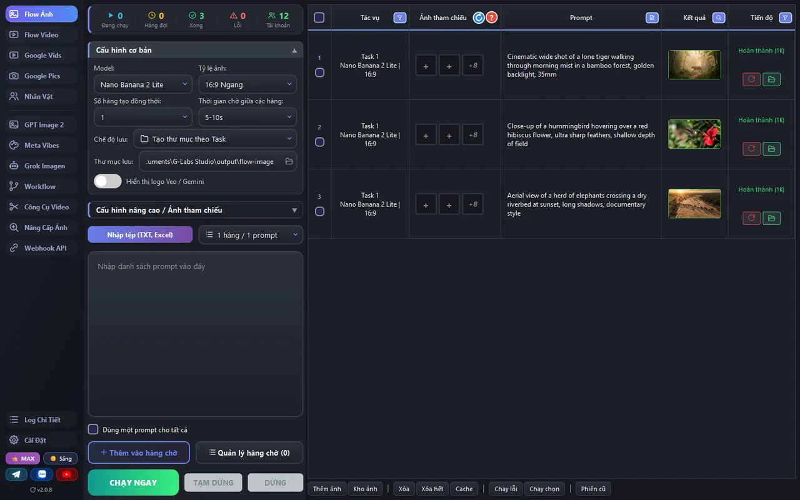

- **Mọi trình tạo lớn, trong một ứng dụng** - Google Flow (ảnh + video), Google Vids, Google Pics, GPT Image 2, Meta Vibes và Grok, mỗi cái trên trang riêng với các mô hình và tỷ lệ mà nhà cung cấp đó hỗ trợ.
- **Được thiết kế để làm hàng loạt** - dán một danh sách prompt (mỗi dòng một prompt) hoặc nhập tệp `.txt`/Excel; mỗi prompt thành một dòng. Ảnh tham chiếu tự khớp theo tên tệp. Chạy cả danh sách với số luồng đồng thời bạn chọn.
- **Thêm trước, chạy khi sẵn sàng** - các dòng vào hàng đợi; **Run / Pause / Stop** tách riêng. Không có gì khởi chạy cho tới khi bạn ra lệnh, và trình quản lý hàng đợi cho phép bạn sắp xếp lại và kiểm tra.
- **Tự xoá logo Gemini ✦** - ảnh Google Pics và video Google Vids được gỡ logo ngay sau khi tải về (muốn giữ logo thì bật **Hiển thị logo Gemini**). Tệp không có logo được để nguyên.
- **Kho nhân vật** - lưu một nhân vật một lần (ảnh tham chiếu + giọng + ghi chú) và gọi bằng `@tên` trong prompt ở Flow Ảnh, Flow Video và Google Vids để các cảnh không lệch nhau.
- **Workflow (đồ thị node)** - nối các node thành một pipeline: prompt → ảnh → video → tách khung hình cuối → video kế tiếp, cùng node **Ghép video** nối hai clip có chuyển cảnh.
- **Công cụ Video** - chỉnh sửa video trên timeline, slide ảnh khớp phụ đề, chia video, xuất khung hình và xoá logo video, ngay trong app.
- **Nâng Cấp Ảnh** ngay trên máy và **Webhook API** cho tự động hoá.
- **Bền bỉ** - kết quả được kiểm tra và tự lưu; phiên làm việc được khôi phục; các dòng thất bại thử lại.
- **Giao diện Sáng / Tối**, UI theo hạng, và **15 ngôn ngữ**.

---

## Các trang

### 🖼 Flow Ảnh - tạo ảnh Google Flow


Tạo ảnh hàng loạt với **Nano Banana Pro / 2 / 2 Lite**. Chọn mô hình, tỷ lệ khung hình và độ phân giải (**1K / 2K / 4K** - 2K/4K dùng bộ nâng cấp của mô hình), đặt số dòng chạy cùng lúc và độ trễ giữa chúng. Dán prompt (hoặc nhập tệp), đính kèm ảnh tham chiếu cho từng dòng (kéo một thư mục và chúng tự khớp theo tên tệp), và dùng `@tên` để kéo nhân vật vào. Công tắc **Hiển thị logo Veo / Gemini** (mặc định tắt) dùng chung với trang Flow Video. **Run** gửi cả danh sách vào hàng đợi.

### 🎬 Flow Video - Veo &amp; Omni Flash

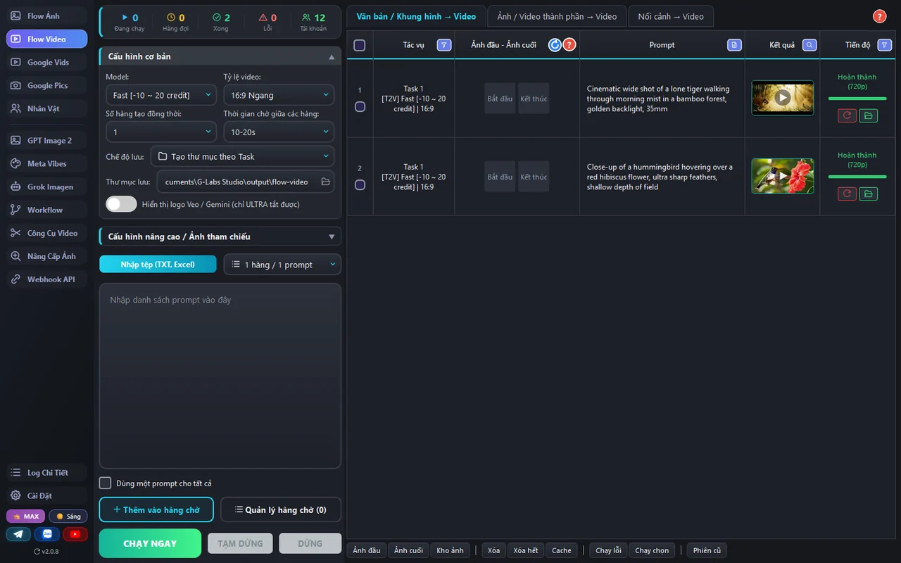

Ba tab: **Văn bản / Khung hình → Video** (một prompt văn bản, hoặc khung đầu/cuối), **Ảnh / Video thành phần → Video** (ảnh hoặc video tham chiếu) và **Nối cảnh → Video**. Mô hình: **Veo 3.1 Fast / Lite / Quality** và **Omni Flash**. Chọn tỷ lệ khung hình, nâng cấp (720p / 1080p / 4K) và seed. Di chuột lên **?** trên thanh tab để có lời giải thích dễ hiểu về khung hình so với thành phần.

### 📽 Google Vids

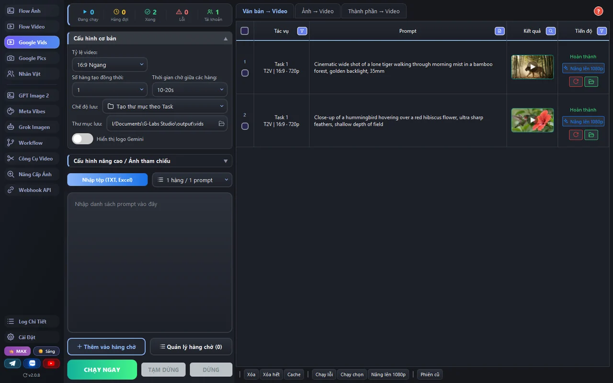

Tạo video bằng tài khoản Google của bạn, ba tab: **Văn bản → Video**, **Ảnh → Video** (một ảnh mở đầu) và **Thành phần → Video** (tối đa 3 ảnh thành phần). Chọn hướng ngang/dọc, độ phân giải 720p / 1080p và thời lượng 3-10 giây - hoặc ghi thẻ như `[4s]` ngay trong prompt để mỗi dòng có thời lượng riêng. Video đã tạo có thể nâng cấp lên 1080p ngay trong bảng. Mỗi tài khoản có hạn mức tính bằng giây video; thêm nhiều tài khoản để chạy nhanh hơn. Logo Gemini ✦ trên video tải về (720p / 1080p) được tự xoá trừ khi bạn bật **Hiển thị logo Gemini**.

### 🖼 Google Pics

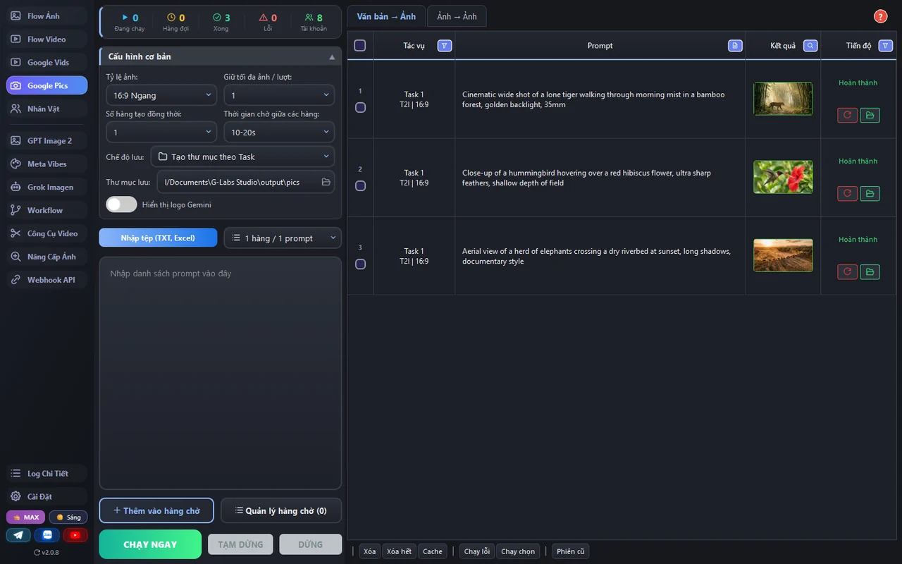

Hai tab: **Văn bản → Ảnh** và **Ảnh → Ảnh** với **tối đa 14 ảnh tham chiếu** (nhân vật, đồ vật, bối cảnh, phong cách). Mỗi lượt Google trả về 3-9 ảnh; **Giữ tối đa ảnh / lượt** quyết định giữ bao nhiêu (1-4 hoặc tất cả). 10 tỷ lệ khung hình, gồm 21:9, 3:2 và 5:4. Mỗi lượt tốn 1 lượt Google Pics bất kể số ảnh; prompt bị chính sách nội dung từ chối thì không tốn. Pics dùng chung **Tài khoản Google** với Google Vids.

**Tự xoá logo Gemini ✦:** ảnh Pics tải về được gỡ dấu ✦ ở góc dưới bên phải ngay sau khi tải, bằng bản đồ logo đo riêng cho Google Pics - đảo ngược phép phủ logo nên vân ảnh gốc dưới logo được khôi phục, không làm nhoè. Ảnh không nhận ra logo thì giữ nguyên. Muốn giữ logo, bật **Hiển thị logo Gemini**.

### ✨ GPT Image 2 - OpenAI

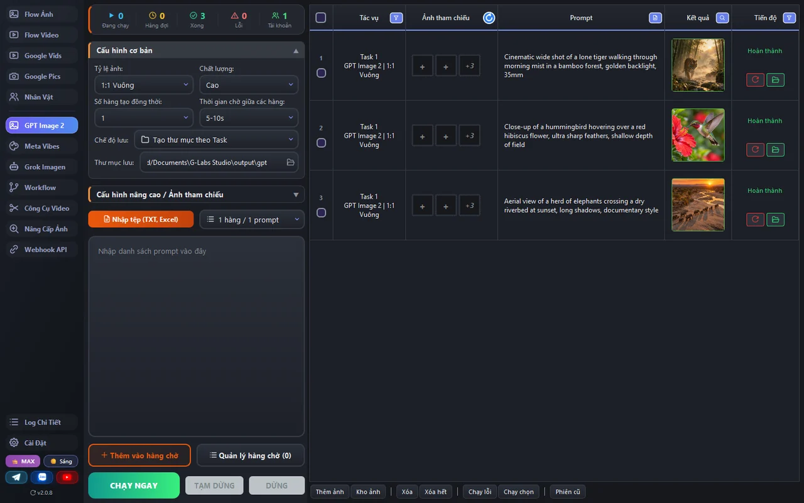

Tạo với OpenAI **GPT Image 2** bằng tài khoản ChatGPT của bạn, với tối đa 5 ảnh tham chiếu. Chọn tỷ lệ (10 tùy chọn gồm 21:9, 4:5 và **tùy chỉnh** - nơi bạn viết tỷ lệ ngay trong prompt), chất lượng, chế độ prompt, mức độ suy luận và tìm kiếm web.

### 🎨 Meta Vibes

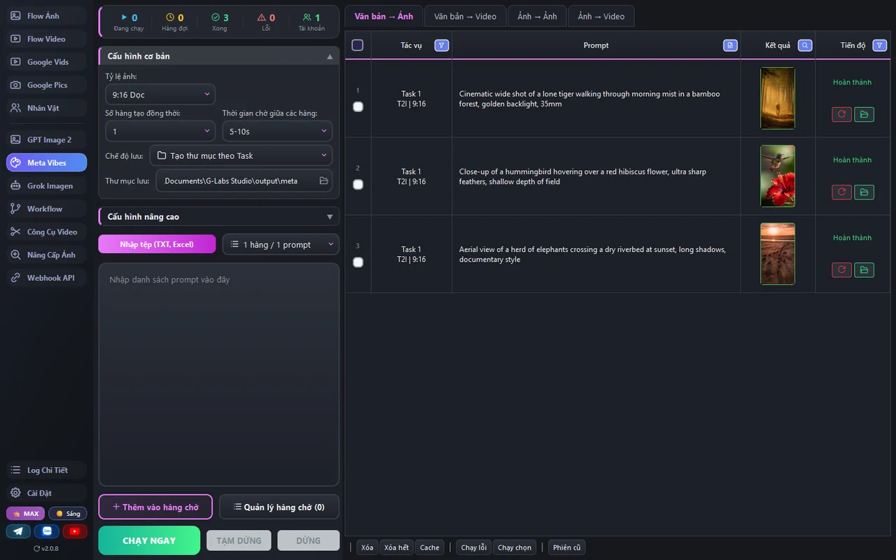

Tạo ảnh và video trên Meta Vibes, bốn tab: **Văn bản → Ảnh**, **Văn bản → Video**, **Ảnh → Ảnh** (ảnh nhân vật / bối cảnh / phong cách) và **Ảnh → Video** (khung đầu / cuối). Xếp hàng và tải về tự động.

### 🤖 Grok Imagen


Văn bản → Ảnh, Ảnh → Ảnh, Văn bản → Video và Ảnh → Video qua Grok Imagine (tab `grok.com` đã đăng nhập của bạn thông qua tiện ích Auth Helper). Ảnh có **8 tỷ lệ khung hình** (gồm 4:3, 21:9, 5:2); video tạo ở **480p / 720p / 1080p**. Ảnh → Video có hai chế độ: **Khung hình đầu** (ảnh mở đầu clip) và **Ảnh thành phần** (tối đa 14 ảnh dẫn hướng).

### 👤 Nhân vật

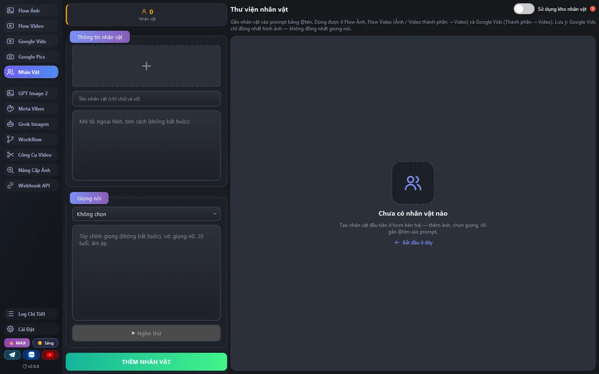

Xây dựng một kho nhân vật tái sử dụng: một ảnh tham chiếu, một giọng (chọn trong các giọng có sẵn của Flow, có thể thêm mô tả cách nói), và ghi chú về diện mạo/tính cách. Gắn thẻ bằng `@tên` trong prompt ở Flow Ảnh, Flow Video và Google Vids và bản tạo sẽ giữ nguyên danh tính đó (giọng chỉ dùng cho Flow Video; Google Vids chỉ dùng ảnh).

### 🔗 Workflow

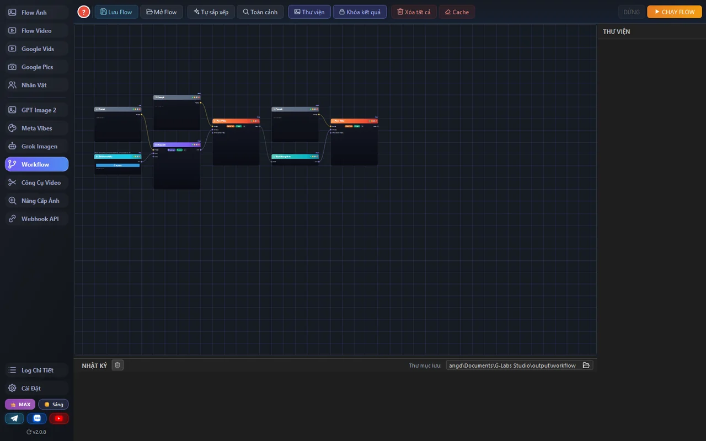

Một canvas node trực quan. Nhấp chuột phải vào socket của một node và menu chỉ đề xuất những node phù hợp - chọn một cái và nó tự nối dây. Có node cho Flow Ảnh, Flow Video, Grok, Meta và GPT Image 2. Nối chuỗi prompt → ảnh → video → **Tách Khung Hình** → video kế tiếp, và dùng **Ghép video** để ghép hai clip (cắt xén mỗi đầu, chọn chuyển cảnh). Lưu/nạp cả đồ thị dưới dạng tệp `.json` (định dạng: [`WORKFLOW_JSON_SPEC.md`](../../WORKFLOW_JSON_SPEC.md)); **Run Flow** thực thi nó từ đầu đến cuối.

### 🎞 Công cụ Video

Năm tab trong một trang:

**Chỉnh sửa video** - timeline cho video, phụ đề SRT và âm thanh: cắt, tách, sắp xếp, tự động điều chỉnh, rồi xuất một video hoàn chỉnh.

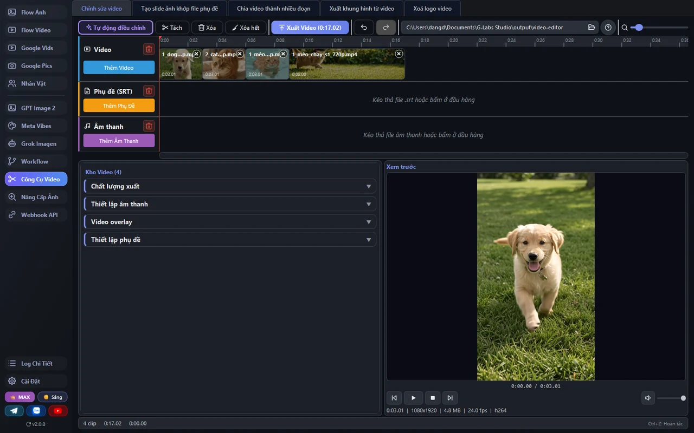

**Tạo slide ảnh khớp file phụ đề** - nạp ảnh và tệp `.srt`, mỗi ảnh tự khớp một dòng phụ đề, có hiệu ứng chuyển động, overlay và thiết lập kiểu phụ đề.

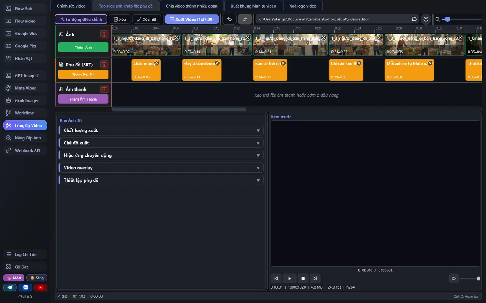

**Chia video thành nhiều đoạn** - chia theo số phần, thời lượng cố định hoặc ngẫu nhiên, danh sách mốc thời gian hay danh sách khoảng A-B; một tệp hoặc hàng loạt, dùng GPU nếu có.

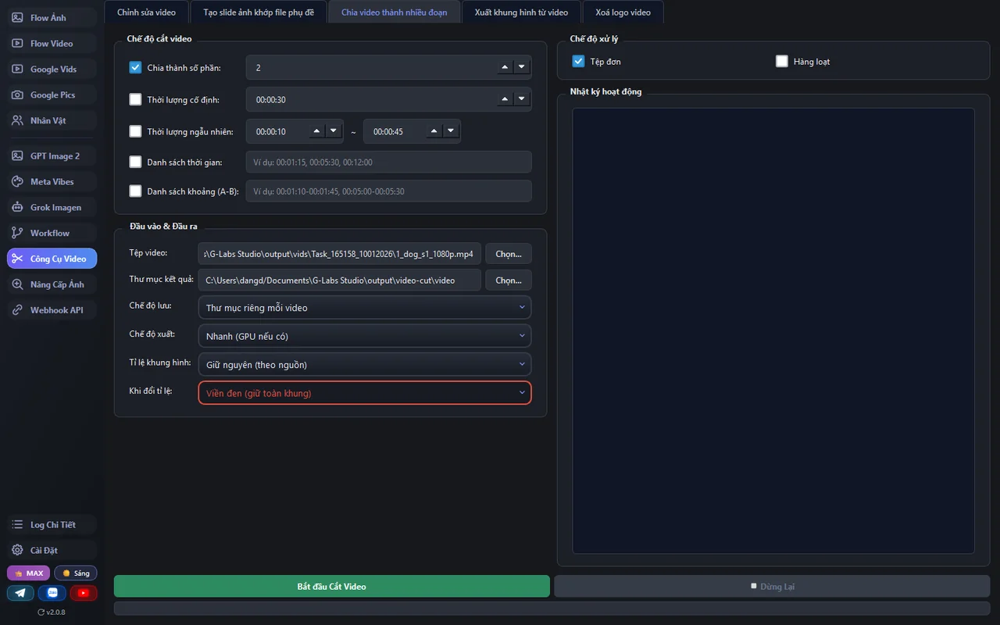

**Xuất khung hình từ video** - tách ảnh theo tổng số ảnh, khoảng thời gian, số khung hình hoặc theo chuyển động; một tệp hoặc cả thư mục.

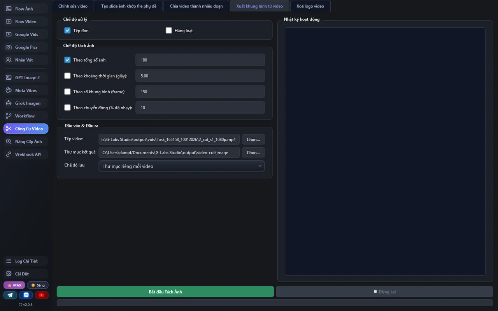

**Xoá logo video** - xoá logo ✦ trên video Google Vids 720p và 1080p (ngang hoặc dọc), xem thử trước/sau ngay trong app. Video không có logo được bỏ qua; tệp gốc giữ nguyên, kết quả lưu thành `<tên>_nologo.mp4`.

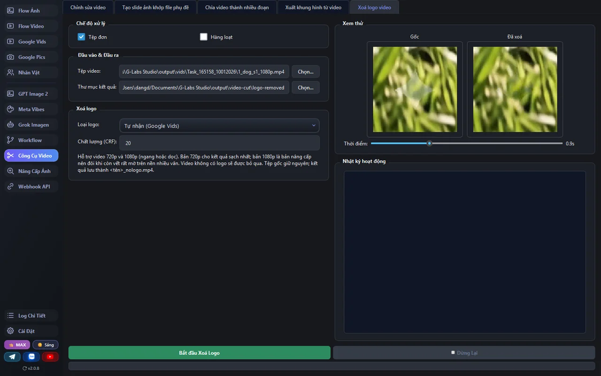

### 🔍 Nâng Cấp Ảnh

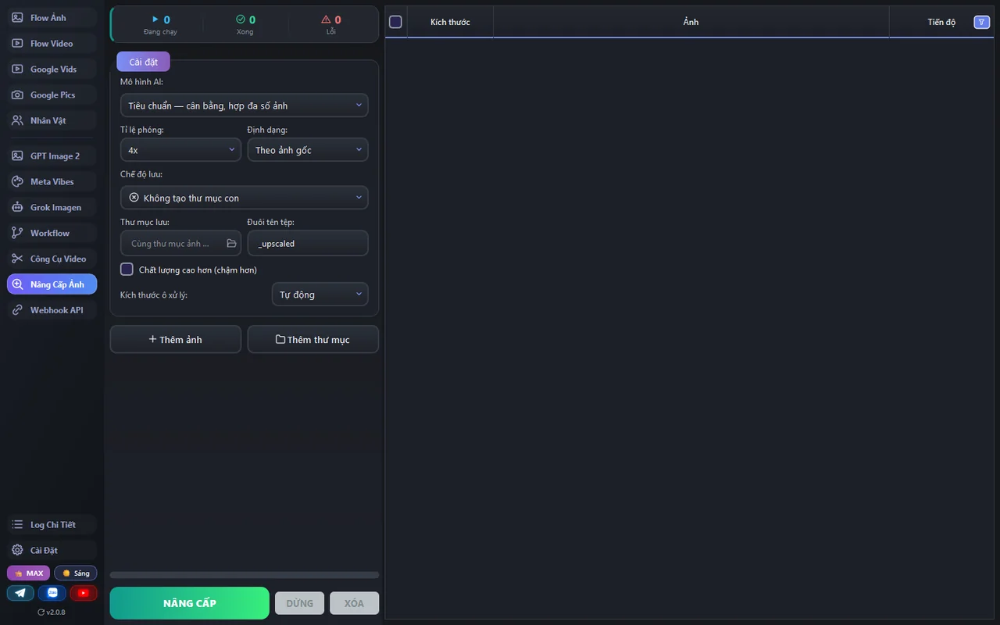

Phóng to và làm nét ảnh ngay trên máy - thêm từng ảnh hoặc cả thư mục, chọn mô hình AI (Real-ESRGAN, UltraSharp, Remacri…) và tỷ lệ 2x-8x, theo dõi tiến độ từng dòng và so sánh trước/sau.

### 🌐 Webhook API

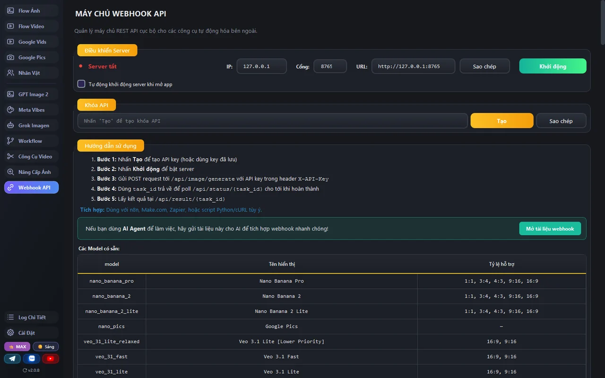

Biến ứng dụng thành máy chủ tự động hóa cục bộ (gói MAX) để n8n, Make, Zapier, script hay AI agent đẩy việc vào hàng đợi của app. Khởi chạy nó, sao chép API key, và POST các tác vụ tới `/api/image/generate`, `/api/video/generate`, `/api/grok/generate`, `/api/meta/generate`, `/api/openai/generate` hoặc `/api/upscale/generate`, rồi truy vấn `/api/status/<id>`. Trang liệt kê mọi mô hình và các tỷ lệ khung hình được hỗ trợ. Lược đồ đầy đủ: [`WEBHOOK_INTEGRATION.vi.md`](../../WEBHOOK_INTEGRATION.vi.md).

---

## Nơi lưu dữ liệu

| Gì | macOS | Windows |
|---|---|---|
| Đầu ra (ảnh / video) | `~/Documents/G-Labs Studio/output` | `%USERPROFILE%\Documents\G-Labs Studio\output` |
| Cài đặt, phiên, tài khoản, nhân vật | `~/Library/Application Support/G-Labs Studio` | `%APPDATA%\G-Labs Studio` |

Mỗi trang có một thư mục con riêng trong `output` (mỗi lần chạy một thư mục nhỏ); bạn có thể đổi thư mục lưu ở từng trang. Cài đặt, danh sách prompt, phiên làm việc, kho nhân vật và danh sách tài khoản của bạn được lưu và khôi phục vào lần tiếp theo bạn mở ứng dụng.

---

## Khắc phục sự cố

**Mọi thứ bị khóa / màn hình mua hàng cứ mở ra** - gói của bạn đã hết hạn, hoặc tài khoản đã đăng nhập trên một máy khác. Kiểm tra huy hiệu hạng (góc dưới bên trái) và gia hạn. Google Vids và Google Pics cần gói PLUS/MAX; Webhook API cần gói MAX.

**Một bản tạo Grok không làm gì cả** - Grok chạy qua tab `grok.com` của bạn. Cài đặt/bật tiện ích trình duyệt **Auth Helper** (Cài Đặt → Tài khoản Grok) và đảm bảo bạn đã đăng nhập grok.com.

**Google Pics báo chưa có tài khoản** - Pics dùng tài khoản Google Vids. Thêm một tài khoản trong Cài Đặt → **Tài khoản Google**.

**"Đang hoạt động: 0 tài khoản" trên một trang** - thêm hoặc bật lại một tài khoản trong tab tài khoản của trang đó (Cài Đặt), hoặc token của nó đã hết hạn - nhấn **Làm mới tất cả**.

**Windows chặn ở "Windows protected your PC"** - bấm **More info → Run anyway**. App chưa mua chứng chỉ ký của Microsoft nên bị cảnh báo, không phải virus.

**macOS báo ứng dụng bị hỏng / không mở được** - nó chưa được Apple ký. Chuột phải → **Open** ở lần đầu, hoặc chạy `xattr -dr com.apple.quarantine "/Applications/G-Labs Studio.app"`.

**Một bản cập nhật không cài được** - tải bản mới nhất thủ công từ [Releases](https://github.com/duckmartians/G-Labs-Studio/releases/latest).
